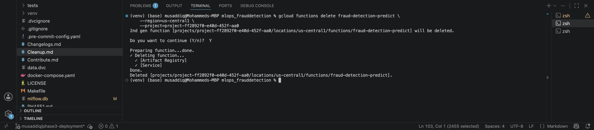
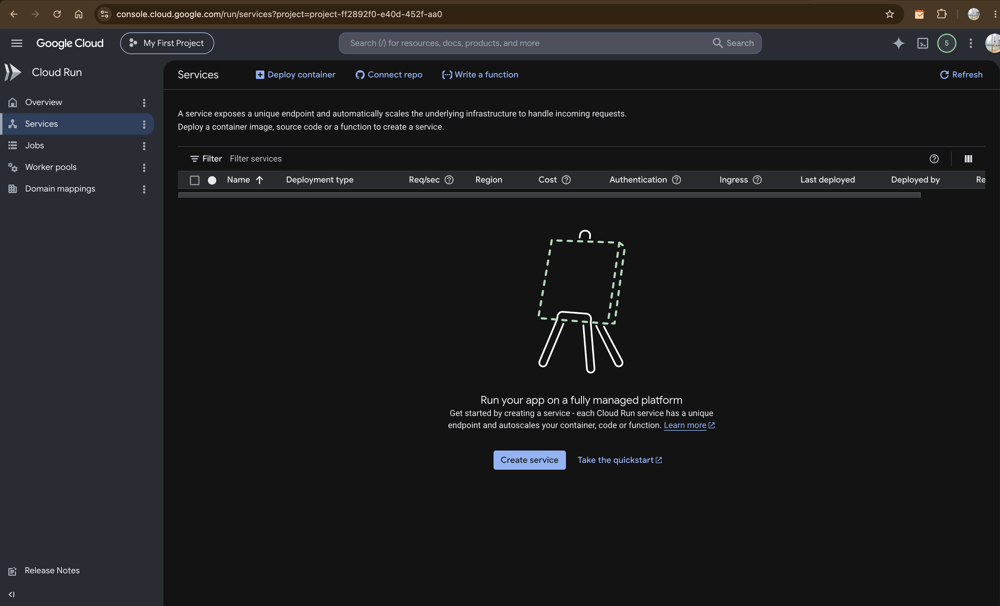
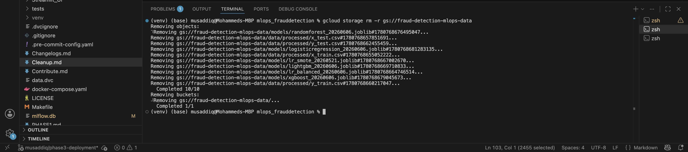
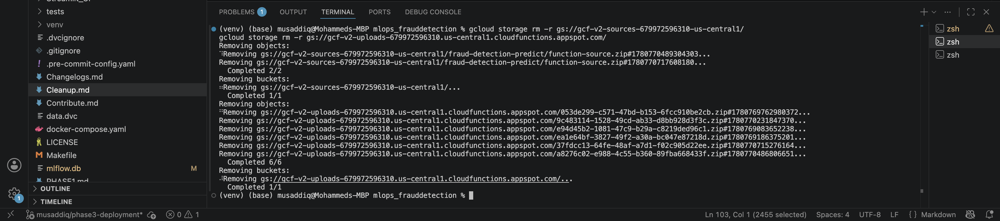
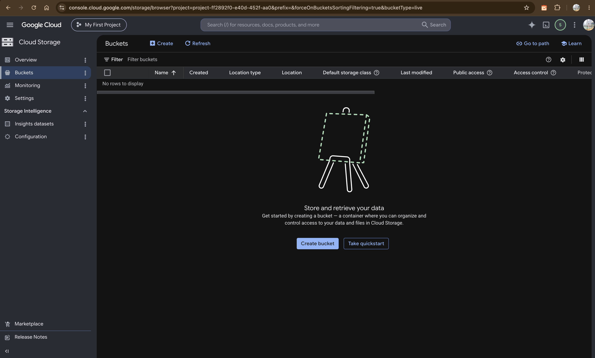
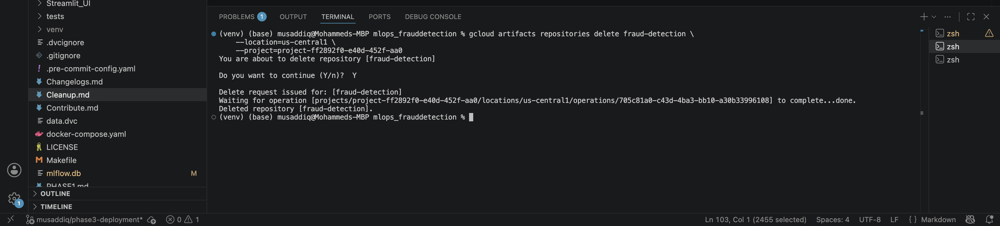
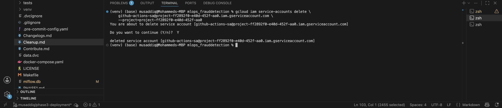
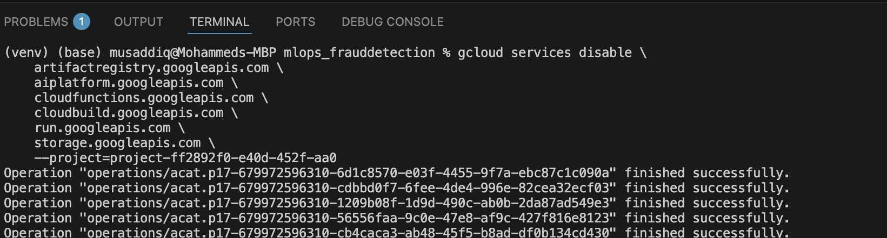
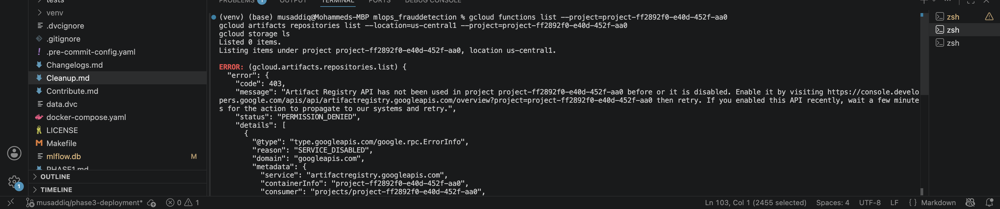
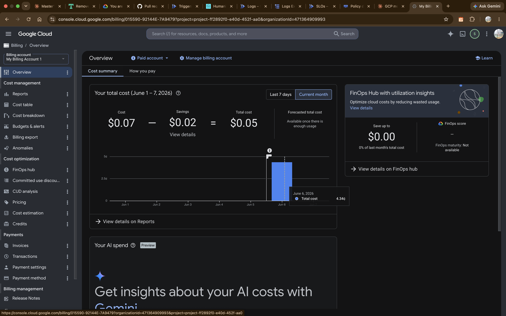

# GCP Resource Cleanup Guide

## Overview
This file shows the steps which should be taken to completely remove all Google Cloud Platform resources created for Phase 3 so that there is nothing additional charged after the grading process.


---

## Cleanup Commands

### Step 1  Delete Cloud Functions
```bash
gcloud functions delete fraud-detection-predict \
    --region=us-central1 \
    --project=project-ff2892f0-e40d-452f-aa0
```

### Step 2  Delete Cloud Run service
```bash
gcloud run services delete fraud-detection-predict \
    --region=us-central1 \
    --project=project-ff2892f0-e40d-452f-aa0
```

### Step 3  Delete GCS bucket
```bash
# Delete all contents first
gcloud storage rm -r gs://fraud-detection-mlops-data

# Verify bucket is empty
gcloud storage ls gs://fraud-detection-mlops-data
```

### Step 4  Delete Artifact Registry
```bash
gcloud artifacts repositories delete fraud-detection \
    --location=us-central1 \
    --project=project-ff2892f0-e40d-452f-aa0
```

### Step 5  Delete Service Account
```bash
gcloud iam service-accounts delete \
    github-actions-sa@project-ff2892f0-e40d-452f-aa0.iam.gserviceaccount.com \
    --project=project-ff2892f0-e40d-452f-aa0
```

### Step 6  Disable APIs
```bash
gcloud services disable \
    artifactregistry.googleapis.com \
    aiplatform.googleapis.com \
    cloudfunctions.googleapis.com \
    cloudbuild.googleapis.com \
    run.googleapis.com \
    storage.googleapis.com \
    --project=project-ff2892f0-e40d-452f-aa0
```

### Step 7  Verify cleanup
```bash
# Check no functions running
gcloud functions list --project=project-ff2892f0-e40d-452f-aa0

# Check no buckets remaining
gcloud storage ls

# Check no Artifact Registry repos
gcloud artifacts repositories list --location=us-central1

# Check Vertex AI jobs
gcloud ai custom-jobs list --region=us-central1
```

---

## Cost Monitoring

Set up a budget alert to avoid surprise charges:

```bash
# View current billing
gcloud billing accounts list

# Check current spend
gcloud billing budgets list \
    --billing-account=01EE2A-B2A5DF-8FB351
```

Or go to: https://console.cloud.google.com/billing

---

##  Important Notes


- Free tier limits: Cloud Functions (2M requests/month), Cloud Run (2M requests/month)
- GCS storage: first 5GB free in us-central1
- Vertex AI training jobs: billed per minute - always check status
- Delete resources in the above order to avoid dependency errors

---

## Evidence

Cleanup tasks were completed successfully. Screenshot for all cleanup activities are listed below.

---

### Step 1  Cloud Functions Deleted



The following command, `gcloud functions delete`, was executed for `fraud-detection-predict` in `us-central1`. Deleting both the Artifact Registry and Service associated with this function was done successfully. This was verified by checking for the message "Done."

---

### Step 2  Cloud Run Services Cleared



If the Cloud Run service gets deleted using the CLI, then the GCP Cloud Run console displays **no services running**.
---

### Step 3  GCS Buckets Deleted

**Main data bucket (`fraud-detection-mlops-data`):**



Finally, the use of `gcloud storage rm -r` command deleted all 10 objects within the bucket `gs://fraud-detection-mlops-data`, as well as deleted the bucket itself; the output shows 'Completed 10/10' and 'Completed 1/1'.

**Cloud Functions staging buckets:**



Also deleted were the additional GCS buckets auto-created by Cloud Functions ('gcf-v2-sources' and 'gcf-v2-uploads'), where 2 out of 2 and 6 out of 6 objects respectively were deleted.

**Cloud Storage console (UI verification):**



GCP Cloud Storage shows **"No rows to display"**, indicating that all of the buckets have been deleted.

---

### Step 4  Artifact Registry Deleted



Artifact Registry 'fraud-detection' repository is successfully deleted as seen on the terminal output, where it displays the delete request made as well as the successful completion of the command: `Deleted repository [fraud-detection]`.

---

### Step 5  Service Account Deleted



The service account `github-actions-sa` has been deleted. As per terminal output, `deleted service

---

### Step 6  APIs Disabled



All 6 APIs of GCP were disabled in a single line command. The return code for each disabled API was `finished successfully`. Hence, the APIs `artifactregistry`, `aiplatform`, `cloudfunctions`, `cloudbuild`, `run`, and `storage` have been disabled.

---

### Step 7  Verification



Executing the commands to verify the completion of the tasks:
- The command `gcloud functions list` showed **0 items**
- The command `gcloud storage ls` showed **0 items**
- The command `gcloud artifacts repositories list` resulted in a SERVICE_DISABLE/PREMISSION_DENIED status, which is **expected**, since the Artifact Registry API was disabled in Step 6.

---

### Cost Summary



From the GCP Billing Console, the bill comes to **$0.05** for the entire period of Phase 3 implementation (June 17, 2026), where most of the costs accrued on June 6 when testing took place actively. No other bills will accrue after cleaning up.
