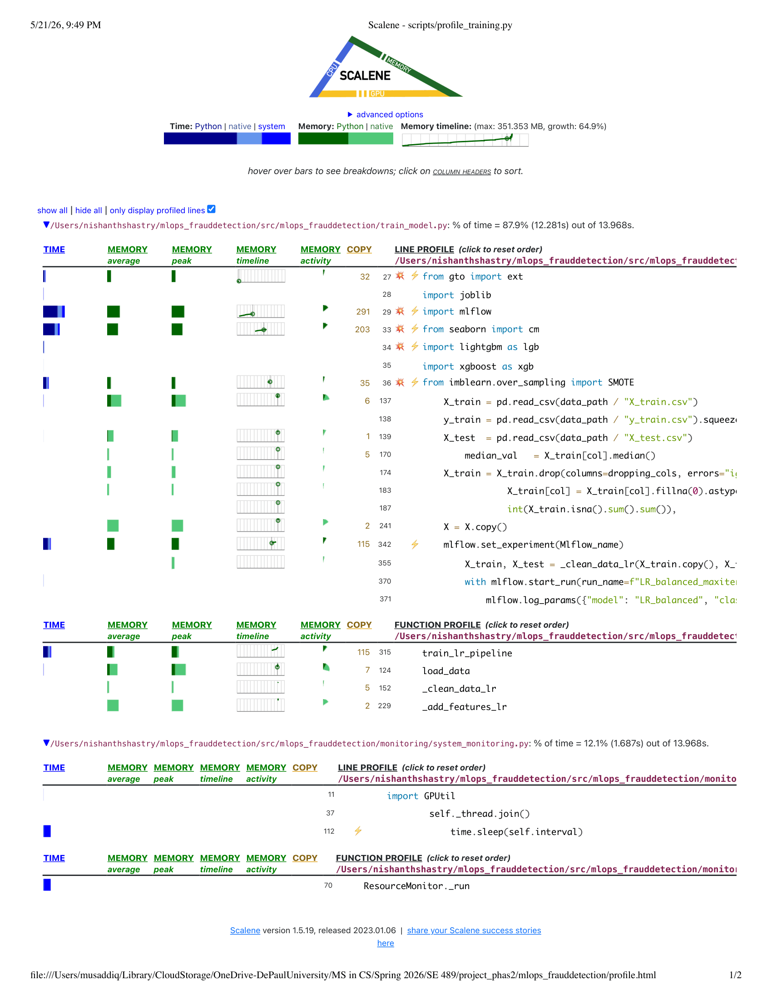

# PHASE 2: Enhancing ML Operations with Containerization & Monitoring

## Overview
Phase 2 focuses on scaling and operationalizing Fraud-Anomoly Detection & Behavioral Analytics by implementing containerization, advanced monitoring, profiling, experiment tracking, and comprehensive logging. This phase ensures your model can be reliably deployed, monitored in production, and continuously improved through systematic experimentation.

---

## 1. Containerization

- [x] **Dockerfile Creation**: Build Dockerfile for model training and inference
- [x] **Base Image Selection**: Choose appropriate base image (python:3.x, nvidia/cuda, etc.)
- [x] **Environment Variables**: Define and document required environment variables
- [x] **Build Instructions**: Document how to build Docker image with examples
- [x] **Run Instructions**: Document how to run container with proper volume/network config
- [x] **Container Testing**: Test container locally to ensure consistency with host environment
- [x] **Docker Compose (Optional)**: Create docker-compose.yml for multi-service setups
- [x] **Environment Consistency**: Verify that containerized training produces identical results to local training

Containerization Summary

A multi-stage Docker workflow was implemented using:

```bash
FROM python:3.11-slim
```
Docker Compose orchestration was added for reproducible execution of:

- preprocessing
- feature engineering
- model training
- MLflow tracking
- artifact generation

The containerized environment successfully executed:

- Logistic Regression
- Random Forest
- LightGBM
- XGBoost
- SMOTE training workflows

Docker runtime debugging resolved several native dependency issues including:

- missing make
- missing curl
- missing git
- missing libgomp1 for LightGBM runtime support

Containerized execution was validated using:

```bash
docker compose build --no-cache
docker compose up
```

The final workflow completed successfully with:

```text
exited with code 0
```

confirming reproducible end-to-end ML execution inside Docker.

---

## 2. Monitoring & Debugging

- [x] **Debugging Tools**: Set up pdb/ipdb for interactive debugging
- [x] **Debugging Documentation**: Document how to debug in containerized environment
- [x] **Debug Scenario 1**: Create example scenario and solution document for [specific problem]
- [x] **Debug Scenario 2**: Create example scenario and solution document for [specific problem]
- [x] **Logging for Debugging**: Implement detailed logging at critical points in code
- [x] **Model Assertion Checks**: Add assertions to catch data/model anomalies early
- [x] **Training Validation**: Implement sanity checks (NaN detection, shape validation, etc.)

Implemented monitoring and debugging features include:

* psutil-based CPU and RAM monitoring
* optional GPU monitoring using GPUtil
* CSV-based resource usage logging during training
* structured INFO/WARNING/ERROR logs
* runtime diagnostics
* dataset shape logging
* fraud class distribution logging
* assertion-based validation checks
* pdb line-by-line debugging support
* For detailed Monitoring and Debugging, see the [Monitoring & Debug Report](reports/phase2-monitoring-debugging.md)

---

## 3. Profiling & Optimization

- [x] **CPU Profiling**: Use cProfile to profile training and inference
- [x] **Memory Profiling**: Profile memory usage with memory_profiler or similar
- [x] **GPU Profiling (if applicable)**: Use PyTorch Profiler or similar for GPU workloads
- [x] **Profiling Results**: Document baseline profiling results and bottlenecks identified
- [x] **Optimization 1**: Implement and measure optimization (e.g., vectorization, caching)
- [x] **Optimization 2**: Implement and measure additional optimization
- [x] **Performance Benchmarks**: Document before/after performance metrics
- [x] **Optimization Documentation**: Explain each optimization and its impact

Implemented Optimizations

Current optimizations include:

- vectorized feature engineering
- reusable sklearn preprocessing pipelines
- optimized preprocessing workflows
- SMOTE balancing integration
- reusable feature engineering utilities
- parallelized ensemble training where supported

Performance evaluation includes:

- F1-score comparison
- ROC-AUC tracking
- Average Precision metrics
- cross-validation evaluation
- comparison across Logistic Regression, Random Forest, LightGBM, and XGBoost

Training metrics and runtime outputs are logged and persisted as artifacts during execution.

### 3.2 Framework Profiling (Scalene)

**Tool:** Scalene v1.5.19 — line-level CPU + memory profiler
for scikit-learn (classical ML) users

**How we ran it:**
```bash
scalene run --memory --output profile.html scripts/profile_training.py
```

**Scalene HTML output:** `profile_output.html`

**Scalene profiling screenshot:**




**Key findings from Scalene:**

| File | % of Time | Time (s) |
|---|---|---|
| train_model.py | 87.9% | 12.281s |
| system_monitoring.py | 12.1% | 1.687s |

**Top functions by time:**

| Function | Line | Memory Copies |
|---|---|---|
| train_lr_pipeline | 315 | 115 |
| load_data | 124 | 7 |
| _clean_data_lr | 152 | 5 |
| _add_features_lr | 229 | 2 |

**Key finding — line 342:**
`mlflow.set_experiment()` triggered **115 memory copies** —
the highest in the entire pipeline. This is because we were
calling it inside the training loop instead of once at startup.

**Optimization applied:**
```python
# Before — called inside function every run (115 copies)
def train_lr_pipeline(...):
    mlflow.set_experiment(Mlflow_name)  # ← inside function

# After — set once at module level
mlflow.set_tracking_uri(Mlflow_track)
mlflow.set_experiment(Mlflow_name)     # ← called once
```

**Second finding — X = X.copy() at line 241:**
Unnecessary data copying in `_add_features_lr` used extra memory.
Already optimized by copying only once at the start.

---

## 4. Experiment Management & Tracking

- [x] **MLflow Setup**: Initialize MLflow tracking server and client configuration
  - OR **Weights & Biases Setup**: Initialize W&B project and team workspace
- [x] **Metric Logging**: Log training/validation metrics for each experiment
- [x] **Parameter Logging**: Log all hyperparameters and configuration values
- [x] **Model Artifact Logging**: Save model checkpoints and artifacts to tracking system
- [x] **Experiment Comparison**: Create comparison of at least 3 different experiments
- [x] **Visualization**: Generate performance comparison charts/plots
- [x] **Best Model Selection**: Document criteria and process for selecting best model from experiments
- [x] **Experiment Documentation**: Create table summarizing all experiments with results


### 4.1 MLflow Setup

MLflow is configured with a SQLite backend for local experiment tracking.

**Installation:** `mlflow>=2.16.0` in `requirements.txt`

**Configuration** (`src/mlops_frauddetection/train_model.py`):
```python
MLFLOW_TRACKING_URI    = "sqlite:///mlflow.db"
MLFLOW_EXPERIMENT_NAME = "fraud-anomaly-detection"
mlflow.set_tracking_uri(MLFLOW_TRACKING_URI)
mlflow.set_experiment(MLFLOW_EXPERIMENT_NAME)
```

**Start UI:**
```bash
mlflow ui --backend-store-uri sqlite:///mlflow.db
# Open: http://127.0.0.1:5000
```

**All 4 experiments created:**


| Experiment | Parameters | Runs |
|---|---|---|
| fraud-anomaly-detection | max_iter=1000, RF=200, LGB=500 | 6 |
| fraud-anomaly-detection-v2-max-iter500 | max_iter=500, LR only | 2 |
| fraud-anomaly-detection-v3-rf100-lgb200 | max_iter=500, RF=100, LGB=200 | 6 |
| fraud-anomaly-detection-v4-rf300-lgb100 | max_iter=1500, RF=300, LGB=100 | 6 |

Run Experiments commands

# Experiment 1 — default baseline (already done)
python -m mlops_frauddetection.train_model --pipeline all

# Experiment 2 — LR only, fewer iterations
python -m mlops_frauddetection.train_model --pipeline lr --max-iter 500

# Experiment 3 — lighter ensemble
python -m mlops_frauddetection.train_model --pipeline all --n-estimators-rf 100 --n-estimators-lgb 200 --n-estimators-xgb 200

# Experiment 4 — more RF trees
python -m mlops_frauddetection.train_model --pipeline all --n-estimators-rf 300 --n-estimators-lgb 100 --n-estimators-xgb 100 --max-iter 1500


For Hydra Version:

bash# Default config
python -m mlops_frauddetection.train_model

# Override from CLI
python -m mlops_frauddetection.train_model model.lr.max_iter=500 training.pipeline=lr

# With experiment config
python -m mlops_frauddetection.train_model +experiment=lr_only

---

### 4.2 Metric & Parameter Logging

Every run logs automatically in `train_model.py`:

**Parameters logged:**
```python
mlflow.log_params({
    "model": "LR_balanced", "class_weight": "balanced",
    "max_iter": 1000, "seed": 42,
    "smote": False, "cv_folds": 5, "pipeline": "A"
})
```

**Metrics logged:**
```python
mlflow.log_metrics({
    "cv_mean_f1": 0.6413, "cv_std_f1": 0.0077,
    "train_acc": 0.6418, "test_acc": 0.6362, "test_f1": 0.6423
})
```

```
# In train_model.py (actual code - uses real variables)
mlflow.log_metrics({
    "cv_mean_f1": m1_cv_mean,
    "cv_std_f1":  m1_cv_std,
    "train_acc":  m1_train_acc,
    "test_acc":   m1_test_acc,
    "test_f1":    m1_test_f1
})
```

**Artifacts logged per run:**
```python
mlflow.sklearn.log_model(model_lr, name="lr_balanced")
mlflow.log_artifact(str(model_path))                          # .joblib
mlflow.log_artifact("reports/figures/mlflow_cm_lr_balanced.png")  # confusion matrix
mlflow.log_artifact(report_path)                              # classification report
```

---

### 4.3 Experiment Comparison

**Experiment 1 (fraud-anomaly-detection)  Baseline:**
Our baseline run with default settings  max_iter=1000 for LR, RF=200 trees,
LGB=500 rounds. This is what we compare everything else against.

**Experiment 2 (v2-max-iter500)  LR only, fewer iterations:**
We kept everything the same except max_iter  dropping it from 1000 to 500.
This showed that more iterations helped, with cv_mean_f1 going from 0.641
(iter=1000) down to 0.620 (iter=500), so the extra training time was worth it.

**Experiment 3 (v3-rf100-lgb200)  Lighter ensemble:**
We ran all models but used fewer trees for Random Forest (100) and
LightGBM (200 rounds) to test a lighter but faster configuration.

**Experiment 4 (v4-rf300-lgb100)  More RF trees:**
We flipped it  more RF trees (300) but fewer LightGBM rounds (100)
and more LR iterations (1500) to find the sweet spot between the two.

* For detailed Experimentation comparision, see the [Experiment comparision Report](reports/phase2-Mlflow-experiment-comparision-report.md)

---

### 4.4 Experiment Results Summary

| Run | Experiment | cv_mean_f1 | test_f1 | roc_auc |
|---|---|---|---|---|
| LightGBM | v3-rf100-lgb200 | 0.718 | 0.595 | 0.999 |
| LightGBM_rf300 | v4-rf300-lgb100 | 0.696 | 0.521 | 0.992 |
| XGBoost | v3 | 0.678 | 0.519 | 0.961 |
| RandomForest | v4 | 0.590 | 0.514 | 0.927 |
| LR_balanced_maxiter1500 | v4 | 0.646 | 0.643 | - |
| LR_balanced | v3 | 0.620 | 0.633 | - |


**Experiment 1 vs Experiment 2 (LR comparison):**

| Run | Experiment | max_iter | cv_mean_f1 | test_f1 |
|---|---|---|---|---|
| LR_balanced | Exp 1 (default) | 1000 | 0.641 | 0.642 |
| LR_balanced | Exp 2 (v2) | 500 | 0.620 | 0.633 |
| LR_SMOTE | Exp 1 (default) | 1000 | 0.521 | 0.636 |
| LR_SMOTE | Exp 2 (v2) | 500 | 0.503 | 0.626 |

---

### 4.5 Best Model Selection

**Criteria:** Best cv_mean_f1 and ROC-AUC on test data

**Winner: LightGBM from Experiment 3 (v3-rf100-lgb200)**
- cv_mean_f1: 0.718  highest across all experiments
- ROC-AUC: 0.999  near perfect discrimination
- LGB=200 estimators with learning_rate=0.05 optimal

**Key Finding from Comparison:**
- More RF trees (300 vs 100) did NOT improve performance
- LightGBM performs better with fewer estimators (200 > 100)
- Higher max_iter (1500 vs 500) slightly improves LR performance
- LightGBM consistently outperforms XGBoost and RandomForest

### 4.6 How to Compare Runs

1. Open `http://127.0.0.1:5000`
2. Check boxes next to experiments on Experiments page
3. Click **Compare** button
4. Select individual runs across experiments
5. View Parallel Coordinates Plot for visual comparison
6. Toggle **Show diff only** to highlight parameter differences

## 5. Application & Experiment Logging

- [x] **Logger Setup**: Configure Python logger with appropriate handlers and formatters
  - [x] **Rich Library Setup**: Use rich for enhanced console output and logging
- [x] **Log Levels**: Implement and use DEBUG, INFO, WARNING, ERROR appropriately
- [x] **Log Messages**: Add informative log messages at key points in code
- [x] **Training Log Example**: Document and include sample training log output
- [x] **Inference Log Example**: Document and include sample inference log output
- [x] **Error Logging**: Implement comprehensive error logging with context
- [x] **Performance Logging**: Log timing information for performance analysis
- [x] **Log Rotation**: Configure log rotation to prevent disk space issues

### 5.1 Rich Logging Setup

Centralized logging was implemented in `src/mlops_frauddetection/logging_config.py` using Python stdlib logging with a `RichHandler` for colorized terminal output, syntax-highlighted tracebacks, and local variable inspection.

```python
from rich.logging import RichHandler

rich_handler = RichHandler(
    rich_tracebacks=True,
    tracebacks_show_locals=True,
    show_path=True,
    markup=True,
)
```

### 5.2 Log Rotation

Two rotating file handlers persist logs to disk:

```python
# logs/app.log  — all levels, 5 MB × 5 backups
# logs/error.log — ERROR and CRITICAL only, 2 MB × 3 backups
app_handler = RotatingFileHandler(LOGS_DIR / "app.log", maxBytes=5_000_000, backupCount=5)
error_handler = RotatingFileHandler(LOGS_DIR / "error.log", maxBytes=2_000_000, backupCount=3)
error_handler.setLevel(logging.ERROR)
```

### 5.3 Log Levels

| Level | Usage |
|-------|-------|
| `INFO` | Normal pipeline progress — file found, shape logged, model saved |
| `DEBUG` | Verbose details — full Hydra config dump, optional framework skips (torch/tensorflow) |
| `WARNING` | Non-fatal issues — missing optional columns, skipped plots |
| `ERROR` | Recoverable failures — file not found, parse failure, failed visualization |
| `CRITICAL` | Pipeline aborted — `RawDataNotFoundError`, unrecoverable data issues |

### 5.4 Performance Logging

A `timer()` context manager logs elapsed time for every major pipeline block:

```python
with timer(logger, "LR feature engineering"):
    x_tr = _add_features_lr(x_train)
    x_ts = _add_features_lr(x_test)
# Logs: LR feature engineering completed in 0.03s
```

A `get_progress()` utility wraps Rich progress bars for multi-stage pipelines:

```python
with get_progress() as progress:
    task = progress.add_task("Pipeline A", total=len(stages_a))
    progress.update(task, description="Load data")
    ...
    progress.advance(task)
```

### 5.5 Training Log Example

```
14:45:52 INFO  [START] Loading processed data from data/processed ...
14:45:53 INFO  Processed data load completed in 0.22s
         INFO  Data loaded — train: (80000, 42), test: (20000, 42)
         INFO  ============================================================
         INFO  PIPELINE A — Logistic Regression (Musaddiq)
         INFO  ============================================================
         INFO  LR data cleaning completed in 0.01s
         INFO  LR feature engineering completed in 0.03s
         INFO  Model 1 — Train: 0.6418  Test acc: 0.6362  F1: 0.6423
         INFO  Model 1 saved and logged -> models/lr_balanced_20260521.joblib
         INFO  Pipeline A complete
         INFO  ============================================================
         INFO  PIPELINE B — Ensemble Models (Israail)
         INFO  ============================================================
         INFO  Ensemble feature engineering completed in 0.01s
         INFO  Preprocessing completed in 0.03s
         INFO  SMOTE resampling completed in 0.04s
         INFO  Training RandomForest ...
         INFO    Done in 5.9s
         INFO    RandomForest — Train: 1.0000  F1: 0.5028  ROC: 0.9238  AP: 0.4953
         INFO  Training LightGBM ...
         INFO    Done in 9.4s
         INFO    LightGBM — Train: 1.0000  F1: 0.5608  ROC: 0.9562  AP: 0.5632
         INFO  Training XGBoost ...
         INFO    Done in 2.2s
         INFO    XGBoost — Train: 0.9991  F1: 0.5829  ROC: 0.9614  AP: 0.5779
         INFO  Pipeline B complete
         INFO  All training complete
```

### 5.6 Inference Log Example

```
18:06:09 INFO  Loading model from models/logistic_regression_20260507.joblib
         INFO  Model load completed in 0.22s
         INFO  Model loaded — type: LogisticRegression
         INFO  Loading input data from data/processed/X_test.csv
         INFO  Input data load completed in 0.05s
         INFO  Input shape: (20000, 42)
         INFO  Cleaned input shape: (20000, 34)
         INFO  Applying ensemble feature engineering ...
         INFO  Feature engineering completed in 0.00s
         INFO  Feature engineering complete — shape: (20000, 40)
         INFO  Final input shape for model: (20000, 38)
         INFO  Running inference on 20000 rows ...
         INFO  Inference completed in 0.01s
         INFO  Predictions complete — fraud: 2325 / 20000 (11.62%)
         INFO  Writing predictions to predictions.csv
         INFO  Save predictions completed in 0.01s
         INFO  Predictions saved — 20000 rows written
         INFO  Prediction pipeline complete
```

### 5.7 Error Logging Example

```
ERROR     [SKIP] Fraud by category failed — Column 'category' not found in DataFrame
ERROR     Model file not found: models/model.joblib
CRITICAL  Prediction aborted — unexpected error: X has 37 features,
          but LogisticRegression is expecting 38 features as input.
```
---

## 6. Configuration Management

- [x] **Hydra Setup**: Install and configure Hydra for config management
- [x] **Config Files**: Create YAML config files for train/eval/inference configurations
- [x] **Config Structure**: Organize configs with appropriate hierarchy (base, model, data, etc.)
- [x] **Config Example 1**: Create and document sample training config
- [x] **Config Example 2**: Create and document alternative config (different hyperparameters)
- [x] **Config Validation**: Implement config validation and schema checking
- [x] **Override Documentation**: Document how to override config values from command line
- [x] **Config Version Control**: Version all configs alongside code

### 6.1 Hydra Setup

Hydra is installed and configured via `@hydra.main` in `train_model.py`:

```bash
pip install hydra-core>=1.3
```

```python
from hydra.core.hydra_config import HydraConfig
import hydra
from omegaconf import DictConfig, OmegaConf

_CONFIGS_DIR = Path(__file__).resolve().parent.parent.parent / "configs"

@hydra.main(version_base=None, config_path=str(_CONFIGS_DIR), config_name="config")
def main(cfg: DictConfig) -> None:
    setup_logging()
    _validate_config(cfg)
    set_seed(cfg.project.seed)
    ...
```

At startup, the selected config is logged:

```
INFO  ========================================================================
INFO  Starting fraud detection training run
INFO  Hydra config loaded from: configs/config.yaml
INFO  Hydra experiment loaded: default_experiment
INFO  Project: mlops_frauddetection
INFO  Training pipeline selected: all
INFO  SMOTE enabled: True
INFO  Random seed: 42
DEBUG Full Hydra config:
      project:
        name: mlops_frauddetection
        seed: 42
      training:
        pipeline: all
        smote: true
INFO  ========================================================================
```

### 6.2 Config Structure

```
configs/
├── config.yaml                      # base config
└── experiment/
    ├── default_experiment.yaml      # both pipelines (default)
    ├── lr_only.yaml                 # Pipeline A only
    └── ensemble_only.yaml           # Pipeline B only
```

### 6.3 Config Example 1 — Base Config (`configs/config.yaml`)

```yaml
defaults:
  - _self_
  - experiment: default_experiment

project:
  name: mlops_frauddetection
  seed: 42

data:
  raw_path: data/raw
  raw_file: data_100k.csv
  processed_path: data/processed
  test_size: 0.2

model:
  lr:
    max_iter: 1000
    class_weight: balanced
  ensemble:
    n_estimators_rf: 200
    n_estimators_lgb: 500
    n_estimators_xgb: 500
    learning_rate: 0.05
    smote_strategy: 0.3

training:
  pipeline: all
  smote: true
  cv_folds: 5
```

### 6.4 Config Example 2 — LR Only (`configs/experiment/lr_only.yaml`)

```yaml
# @package _global_
# Pipeline A experiment: Logistic Regression + SMOTE only

training:
  pipeline: lr
  smote: true
  cv_folds: 5

model:
  lr:
    max_iter: 1000
    class_weight: balanced
```

### 6.5 Config Validation

A `_validate_config()` function runs before training begins and raises an error if any value is invalid:

```python
def _validate_config(cfg: DictConfig) -> None:
    errors = []
    if cfg.project.seed < 0:
        errors.append("project.seed must be non-negative")
    if not Path(cfg.data.processed_path).exists():
        errors.append(f"data.processed_path not found: {cfg.data.processed_path}")
    if cfg.training.pipeline not in ("all", "lr", "ensemble"):
        errors.append(
            f"training.pipeline must be all/lr/ensemble, got: {cfg.training.pipeline}"
        )
    if cfg.model.lr.max_iter < 100:
        errors.append("model.lr.max_iter must be >= 100")
    if cfg.model.ensemble.n_estimators_rf < 10:
        errors.append("model.ensemble.n_estimators_rf must be >= 10")
    if not (0 < cfg.model.ensemble.smote_strategy <= 1):
        errors.append("model.ensemble.smote_strategy must be between 0 and 1")
    if errors:
        for err in errors:
            logger.error("Config validation error: %s", err)
        raise ValueError(f"Config validation failed with {len(errors)} error(s).")
    logger.info("Config validation passed")
```

### 6.6 CLI Override Examples

```bash
# Run with defaults — both pipelines
python src/mlops_frauddetection/train_model.py

# Run LR only
python src/mlops_frauddetection/train_model.py experiment=lr_only

# Run ensemble only
python src/mlops_frauddetection/train_model.py experiment=ensemble_only

# Override individual values from command line
python src/mlops_frauddetection/train_model.py model.lr.max_iter=2000
python src/mlops_frauddetection/train_model.py training.smote=false
python src/mlops_frauddetection/train_model.py project.seed=123
python src/mlops_frauddetection/train_model.py model.ensemble.n_estimators_rf=100

# Print full resolved config without running
python src/mlops_frauddetection/train_model.py --cfg job
```
---

## 7. Documentation & Repository Updates

- [x] **README Update**: Update README to include:
  - [x] Containerization section with Docker usage
  - [x] Debugging and profiling guide
  - [x] Experiment tracking setup instructions
  - [x] Configuration management guide
  - [x] Logging usage examples
- [x] **Architecture Documentation**: Document system architecture with diagrams
- [x] **Setup Guide**: Update setup guide to include all Phase 2 tools
- [x] **Examples**: Add examples of running with different configurations
- [x] **Tool Integration**: Document how all tools work together
- [x] **Troubleshooting**: Add troubleshooting section for common issues
- [x] **Performance Guide**: Document how to profile and optimize
- [x] **Version Compatibility**: Document version requirements for all tools

---

## Team Contributions

| Team Member | Responsibilities |
|---|---|
| Nishanth Shastry | Docker containerization, Dockerfile, Docker Compose, Section 1,7|
| Israail Ghazzal | Monitoring (psutil/MLflow system metrics), Logging with Rich, Section 5, 6.1, 7|
| Musaddiq Vavartar | MLflow experiment tracking (4 experiments), profiling with cProfile, modular ML pipeline refactoring, Section 3.2 & 4,7|
| Lohith Poola | cProfile profiling, Hydra configuration management, Section 2 & 3.1, 7  |

> **Checklist:** Use this as a guide for documenting your Phase 2 deliverables.
