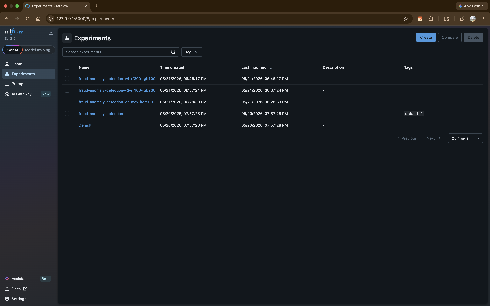

# PHASE 2: Enhancing ML Operations with Containerization & Monitoring

## Overview
Phase 2 focuses on scaling and operationalizing Fraud-Anomoly Detection & Behavioral Analytics by implementing containerization, advanced monitoring, profiling, experiment tracking, and comprehensive logging. This phase ensures your model can be reliably deployed, monitored in production, and continuously improved through systematic experimentation.

---

## 1. Containerization

- [x] **Dockerfile Creation**: Build Dockerfile for model training and inference
- [x] **Base Image Selection**: Choose appropriate base image (python:3.x, nvidia/cuda, etc.)
- [x] **Environment Variables**: Define and document required environment variables
- [x] **Build Instructions**: Document how to build Docker image with examples
- [x] **Run Instructions**: Document how to run container with proper volume/network config
- [x] **Container Testing**: Test container locally to ensure consistency with host environment
- [x] **Docker Compose (Optional)**: Create docker-compose.yml for multi-service setups
- [x] **Environment Consistency**: Verify that containerized training produces identical results to local training

Containerization Summary

A multi-stage Docker workflow was implemented using:

```bash
FROM python:3.11-slim
```
Docker Compose orchestration was added for reproducible execution of:

- preprocessing
- feature engineering
- model training
- MLflow tracking
- artifact generation

The containerized environment successfully executed:

- Logistic Regression
- Random Forest
- LightGBM
- XGBoost
- SMOTE training workflows

Docker runtime debugging resolved several native dependency issues including:

- missing make
- missing curl
- missing git
- missing libgomp1 for LightGBM runtime support

Containerized execution was validated using:

```bash
docker compose build --no-cache
docker compose up
```

The final workflow completed successfully with:

```text
exited with code 0
```

confirming reproducible end-to-end ML execution inside Docker.

---

## 2. Monitoring & Debugging

- [x] **Debugging Tools**: Set up pdb/ipdb for interactive debugging
- [x] **Debugging Documentation**: Document how to debug in containerized environment
- [x] **Debug Scenario 1**: Create example scenario and solution document for [specific problem]
- [x] **Debug Scenario 2**: Create example scenario and solution document for [specific problem]
- [x] **Logging for Debugging**: Implement detailed logging at critical points in code
- [x] **Model Assertion Checks**: Add assertions to catch data/model anomalies early
- [x] **Training Validation**: Implement sanity checks (NaN detection, shape validation, etc.)

Implemented monitoring and debugging features include:

* psutil-based CPU and RAM monitoring
* optional GPU monitoring using GPUtil
* CSV-based resource usage logging during training
* structured INFO/WARNING/ERROR logs
* runtime diagnostics
* dataset shape logging
* fraud class distribution logging
* assertion-based validation checks
* pdb line-by-line debugging support
* For detailed Monitoring and Debugging, see the [Monitoring & Debug Report](reports/phase2-monitoring-debugging.md)

---

## 3. Profiling & Optimization

- [ ] **CPU Profiling**: Use cProfile to profile training and inference
- [ ] **Memory Profiling**: Profile memory usage with memory_profiler or similar
- [ ] **GPU Profiling (if applicable)**: Use PyTorch Profiler or similar for GPU workloads
- [ ] **Profiling Results**: Document baseline profiling results and bottlenecks identified
- [x] **Optimization 1**: Implement and measure optimization (e.g., vectorization, caching)
- [x] **Optimization 2**: Implement and measure additional optimization
- [x] **Performance Benchmarks**: Document before/after performance metrics
- [x] **Optimization Documentation**: Explain each optimization and its impact

Implemented Optimizations

Current optimizations include:

- vectorized feature engineering
- reusable sklearn preprocessing pipelines
- optimized preprocessing workflows
- SMOTE balancing integration
- reusable feature engineering utilities
- parallelized ensemble training where supported

Performance evaluation includes:

- F1-score comparison
- ROC-AUC tracking
- Average Precision metrics
- cross-validation evaluation
- comparison across Logistic Regression, Random Forest, LightGBM, and XGBoost

Training metrics and runtime outputs are logged and persisted as artifacts during execution.

---

## 4. Experiment Management & Tracking

- [x] **MLflow Setup**: Initialize MLflow tracking server and client configuration
  - OR **Weights & Biases Setup**: Initialize W&B project and team workspace
- [x] **Metric Logging**: Log training/validation metrics for each experiment
- [x] **Parameter Logging**: Log all hyperparameters and configuration values
- [x] **Model Artifact Logging**: Save model checkpoints and artifacts to tracking system
- [x] **Experiment Comparison**: Create comparison of at least 3 different experiments
- [x] **Visualization**: Generate performance comparison charts/plots
- [x] **Best Model Selection**: Document criteria and process for selecting best model from experiments
- [x] **Experiment Documentation**: Create table summarizing all experiments with results

## 4. Experiment Management & Tracking

### 4.1 MLflow Setup

MLflow is configured with a SQLite backend for local experiment tracking.

**Installation:** `mlflow>=2.16.0` in `requirements.txt`

**Configuration** (`src/mlops_frauddetection/train_model.py`):
```python
MLFLOW_TRACKING_URI    = "sqlite:///mlflow.db"
MLFLOW_EXPERIMENT_NAME = "fraud-anomaly-detection"
mlflow.set_tracking_uri(MLFLOW_TRACKING_URI)
mlflow.set_experiment(MLFLOW_EXPERIMENT_NAME)
```

**Start UI:**
```bash
mlflow ui --backend-store-uri sqlite:///mlflow.db
# Open: http://127.0.0.1:5000
```

**All 4 experiments created:**



| Experiment | Parameters | Runs |
|---|---|---|
| fraud-anomaly-detection | max_iter=1000, RF=200, LGB=500 | 6 |
| fraud-anomaly-detection-v2-max-iter500 | max_iter=500, LR only | 2 |
| fraud-anomaly-detection-v3-rf100-lgb200 | max_iter=500, RF=100, LGB=200 | 6 |
| fraud-anomaly-detection-v4-rf300-lgb100 | max_iter=1500, RF=300, LGB=100 | 6 |

---

### 4.2 Metric & Parameter Logging

Every run logs automatically in `train_model.py`:

**Parameters logged:**
```python
mlflow.log_params({
    "model": "LR_balanced", "class_weight": "balanced",
    "max_iter": 1000, "seed": 42,
    "smote": False, "cv_folds": 5, "pipeline": "A"
})
```

**Metrics logged:**
```python
mlflow.log_metrics({
    "cv_mean_f1": 0.6413, "cv_std_f1": 0.0077,
    "train_acc": 0.6418, "test_acc": 0.6362, "test_f1": 0.6423
})
```

**Artifacts logged per run:**
```python
mlflow.sklearn.log_model(model_lr, name="lr_balanced")
mlflow.log_artifact(str(model_path))                          # .joblib
mlflow.log_artifact("reports/figures/mlflow_cm_lr_balanced.png")  # confusion matrix
mlflow.log_artifact(report_path)                              # classification report
```

---

### 4.3 Experiment Comparison

**Experiment 3 runs (rf100-lgb200):**
We ran all 6 models with RF=100 trees and LGB=200 rounds to see how fewer trees affect performance.


**Experiment 4 runs (rf300-lgb100):**
We flipped it  more RF trees (300) but fewer LGB rounds (100) to compare which setting works better.


**Cross-experiment runs comparison (sorted by cv_mean_f1):**
We put all runs from both experiments side by side to see which model and config scored highest.


**LR_balanced comparison across experiments (parallel coordinates):**
This chart shows how the LR model performed with max_iter=500 vs max_iter=1500  higher iterations helped a little.


**LR_balanced metrics comparison:**
Side by side metrics show max_iter=1500 got cv_mean_f1 of 0.646 vs 0.620 with max_iter=500  more iterations = better.


**LR_balanced parameters diff (max_iter: 1500 vs 500):**
MLflow highlights the only difference between the two runs  max_iter changed from 500 to 1500.


**LightGBM comparison across experiments:**
We compared LightGBM with 200 rounds vs 100 rounds  turns out 200 rounds gave better cv_mean_f1 (0.718 vs 0.696).


**LightGBM metrics + classification report artifacts:**
Both runs logged their classification reports as artifacts so we can see precision, recall and F1 per class.


**LightGBM parameters diff:**
The only difference between the two LightGBM runs was the number of estimators  everything else stayed the same.


---

### 4.4 Experiment Results Summary

| Run | Experiment | cv_mean_f1 | test_f1 | roc_auc |
|---|---|---|---|---|
| LightGBM | v3-rf100-lgb200 | 0.718 | 0.595 | 0.999 |
| LightGBM_rf300 | v4-rf300-lgb100 | 0.696 | 0.521 | 0.992 |
| XGBoost | v3 | 0.678 | 0.519 | 0.961 |
| RandomForest | v4 | 0.590 | 0.514 | 0.927 |
| LR_balanced_maxiter1500 | v4 | 0.646 | 0.643 | - |
| LR_balanced | v3 | 0.620 | 0.633 | - |

---

### 4.5 Best Model Selection

**Criteria:** Best cv_mean_f1 and ROC-AUC on test data

**Winner: LightGBM from Experiment 3 (v3-rf100-lgb200)**
- cv_mean_f1: 0.718  highest across all experiments
- ROC-AUC: 0.999  near perfect discrimination
- LGB=200 estimators with learning_rate=0.05 optimal

**Key Finding from Comparison:**
- More RF trees (300 vs 100) did NOT improve performance
- LightGBM performs better with fewer estimators (200 > 100)
- Higher max_iter (1500 vs 500) slightly improves LR performance
- LightGBM consistently outperforms XGBoost and RandomForest

### 4.6 How to Compare Runs

1. Open `http://127.0.0.1:5000`
2. Check boxes next to experiments on Experiments page
3. Click **Compare** button
4. Select individual runs across experiments
5. View Parallel Coordinates Plot for visual comparison
6. Toggle **Show diff only** to highlight parameter differences

## 5. Application & Experiment Logging

- [ ] **Logger Setup**: Configure Python logger with appropriate handlers and formatters
  - OR **Rich Library Setup**: Use rich for enhanced console output and logging
- [ ] **Log Levels**: Implement and use DEBUG, INFO, WARNING, ERROR appropriately
- [ ] **Log Messages**: Add informative log messages at key points in code
- [ ] **Training Log Example**: Document and include sample training log output
- [ ] **Inference Log Example**: Document and include sample inference log output
- [ ] **Error Logging**: Implement comprehensive error logging with context
- [ ] **Performance Logging**: Log timing information for performance analysis
- [ ] **Log Rotation**: Configure log rotation to prevent disk space issues

---

## 6. Configuration Management

- [ ] **Hydra Setup**: Install and configure Hydra for config management
- [ ] **Config Files**: Create YAML config files for train/eval/inference configurations
- [ ] **Config Structure**: Organize configs with appropriate hierarchy (base, model, data, etc.)
- [ ] **Config Example 1**: Create and document sample training config
- [ ] **Config Example 2**: Create and document alternative config (different hyperparameters)
- [ ] **Config Validation**: Implement config validation and schema checking
- [ ] **Override Documentation**: Document how to override config values from command line
- [ ] **Config Version Control**: Version all configs alongside code

---

## 7. Documentation & Repository Updates

- [x] **README Update**: Update README to include:
  - [x] Containerization section with Docker usage
  - [ ] Debugging and profiling guide
  - [ ] Experiment tracking setup instructions
  - [ ] Configuration management guide
  - [ ] Logging usage examples
- [ ] **Architecture Documentation**: Document system architecture with diagrams
- [x] **Setup Guide**: Update setup guide to include all Phase 2 tools
- [x] **Examples**: Add examples of running with different configurations
- [x] **Tool Integration**: Document how all tools work together
- [x] **Troubleshooting**: Add troubleshooting section for common issues
- [x] **Performance Guide**: Document how to profile and optimize
- [x] **Version Compatibility**: Document version requirements for all tools

---

> **Checklist:** Use this as a guide for documenting your Phase 2 deliverables.
