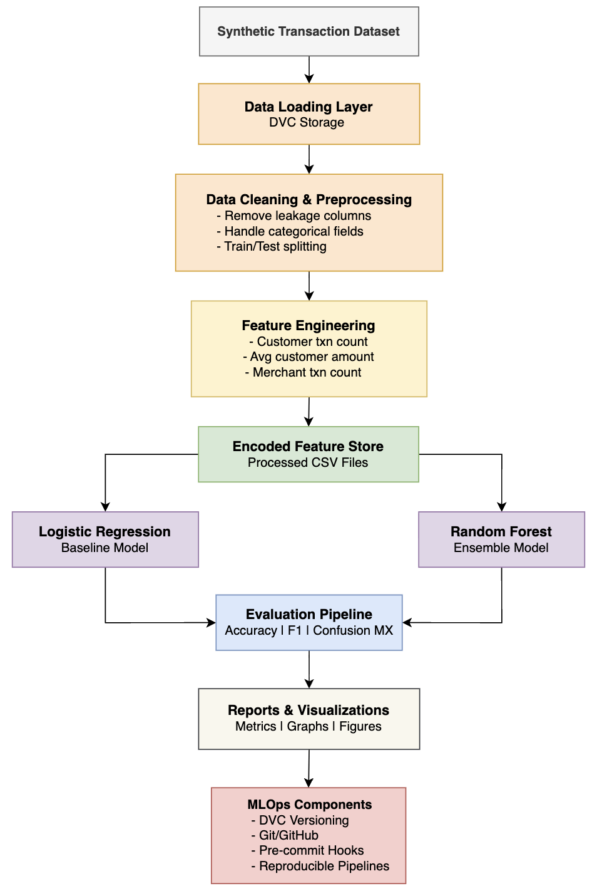

# Fraud Anomaly Classification & Behavioral Analytics

Scalable machine learning system for multi-class fraud anomaly classification, transaction behavior analysis, and financial risk analytics.

## Team Information

- **Project Lead:** MergeDeployGraduate (nshastry@depaul.edu)
- **Team Members:**
    - Nishanth Shekhar Shastry
    - Mohammed Musaddiq Vavartar
    - Lohith Poola
    - Israail Ghazzal

## Project Overview

Fraud Anomaly Classification & Behavioral Analytics is an MLOps-focused machine learning project designed to classify financial transactions into multiple behavioral and fraud-risk categories.

Unlike traditional binary fraud detection systems, this project introduces a multi-class classification approach to better represent varying levels of transactional risk and suspicious activity.

The system processes synthetic financial transaction data containing customer behavior, merchant activity, temporal patterns, and transaction metadata. The project focuses on building a reproducible and scalable ML workflow using modern MLOps practices such as DVC, modular pipelines, reproducible preprocessing, feature engineering, version control, and experiment tracking.

The project currently includes:
- Reproducible preprocessing pipelines
- Feature engineering for behavioral analytics
- Logistic Regression baseline model
- Random Forest ensemble model experimentation
- DVC integration for dataset versioning
- Modular `src/`-based architecture
- Automated testing and linting support

### Transaction Classes

| Label | Description |
|---|---|
| TT | Fully legitimate transaction |
| TF | Legitimate transaction with suspicious behavior |
| FT | Fraudulent transaction with lower financial impact |
| FF | Fraudulent transaction with high financial impact |

### Key Objectives

- Build a scalable fraud anomaly classification pipeline
- Analyze customer and merchant behavioral patterns
- Compare baseline and ensemble ML models
- Establish reproducible MLOps workflows for future deployment

## Dataset Information

This project uses a synthetic financial transaction dataset designed for fraud analytics and behavioral risk modeling.

### Dataset Characteristics

- 43 total features
- Synthetic transaction records
- Customer demographic information
- Merchant activity information
- Transaction behavioral metrics
- Temporal transaction features
- Fraud labels and risk indicators

### Key Feature Categories

#### Customer Features
- Gender
- Age
- Job
- Customer transaction frequency
- Average spending behavior

#### Merchant Features
- Merchant name
- Merchant transaction counts
- Merchant risk scores

#### Transaction Features
- Transaction amount
- Transaction category
- Transaction timestamps
- Weekend/night indicators

### Target Variable

Current Phase 1 experimentation uses the binary `is_fraud` target as the baseline benchmark for fraud detection.

The project is designed to evolve toward a future multi-class fraud anomaly classification system with the following planned categories:

| Label | Description |
|---|---|
| TT | Fully legitimate transaction |
| TF | Legitimate transaction with suspicious behavior |
| FT | Fraudulent transaction with lower financial impact |
| FF | Fraudulent transaction with high financial impact |

## Architecture Diagram

The following architecture represents the end-to-end MLOps workflow implemented for fraud anomaly classification and behavioral analytics.



## Phase Deliverables

### Phase 1: Project Design & Model Development
- See [PHASE1.md](PHASE1.md) for detailed checklist

### Phase 2: Containerization & Monitoring
- See [PHASE2.md](PHASE2.md) for detailed checklist

### Phase 3: CI/CD & Deployment
- See [PHASE3.md](PHASE3.md) for detailed checklist

## Setup Instructions

### Prerequisites
- Python 3.11+ installed
- Git installed
- (Optional) Docker and Docker Compose

### Installation

**Option 1: Using uv (recommended - faster)**
```bash
pip install uv
uv pip install -r requirements.txt
```

**Option 2: Using pip**
```bash
pip install -U pip
pip install -r requirements.txt
```

### Development Setup

```bash
# Install development dependencies
pip install -r requirements_dev.txt

# Set up pre-commit hooks
pre-commit install

# Run tests to verify setup
pytest tests/
```

### Running the Pipeline

```bash
# Prepare data
make data

# Train the model
make train

# Generate predictions
make predict

# See all available commands
make help
```

## Technology Stack

### Core Dependencies
- **numpy** >= 1.26.0 - Numerical computing
- **pandas** >= 2.2.0 - Data manipulation
- **scikit-learn** >= 1.5.0 - Machine learning algorithms
- **matplotlib** >= 3.9.0 - Visualization
- **tqdm** >= 4.66.0 - Progress bars
- **pyyaml** >= 6.0 - Configuration files
### Experiment Tracking
- **mlflow** >= 2.16.0 - MLflow experiment tracking
### Configuration Management
- **hydra-core** >= 1.3.0 - Hydra configuration framework
- **omegaconf** >= 2.3.0 - Hierarchical configuration
### Data Version Control
- **dvc** >= 3.55.0 - Data Version Control

### Development Tools
- **pytest** >= 8.0 - Testing framework
- **pytest-cov** >= 5.0 - Code coverage
- **ruff** >= 0.6.0 - Linting and formatting
- **mypy** >= 1.11 - Static type checking
- **pre-commit** >= 3.8 - Git hooks framework

## Project Structure

This template uses the modern **`src/` layout** — the importable package lives in `src/mlops_frauddetection/`, decoupled from the repository root. That forces `pip install -e .` before imports work, which catches packaging bugs early.

```
mlops_frauddetection/                  # Repository root
├── src/
│   └── mlops_frauddetection/          # Importable Python package
│       ├── __init__.py                # Version + package metadata
│       ├── config.py                  # Paths & typed config (PROJECT_ROOT, TrainingConfig, ...)
│       ├── logging_config.py          # setup_logging() + get_logger()
│       ├── data/
│       │   ├── __init__.py
│       │   ├── loaders.py             # load_raw / load_processed / save_processed
│       │   └── make_dataset.py        # Raw → processed pipeline CLI
│       ├── features/
│       │   ├── __init__.py
│       │   └── build_features.py      # Feature engineering
│       ├── models/
│       │   ├── __init__.py
│       │   ├── base.py                # BaseModel ABC (fit/predict/save/load)
│       │   └── model.py               # Concrete Model scaffold
│       ├── evaluation/
│       │   ├── __init__.py
│       │   └── metrics.py             # classification_report, regression_report
│       ├── visualization/
│       │   ├── __init__.py
│       │   └── visualize.py           # Plot helpers
│       ├── utils/
│       │   ├── __init__.py
│       │   ├── io.py                  # JSON helpers
│       │   └── seed.py                # set_seed for reproducibility
│       ├── train_model.py             # Training CLI
│       └── predict_model.py           # Inference CLI
├── tests/                             # Unit and integration tests
│   ├── conftest.py
│   └── test_model.py
├── data/
│   ├── raw/                           # Immutable raw data
│   └── processed/                     # Cleaned, transformed data
├── models/                            # Trained model artifacts (.joblib)
├── notebooks/                         # Jupyter notebooks for exploration
├── reports/
│   └── figures/                       # Generated analysis and figures
├── docs/                              # MkDocs documentation
│   ├── mkdocs.yml
│   ├── index.md
│   ├── getting_started.md
│   └── api.md
├── dockerfiles/                       # Docker configuration
│   └── Dockerfile
├── configs/                           # Hydra configuration (if selected)
│   └── config.yaml
├── api/                               # FastAPI service (if selected)
├── .github/workflows/                 # GitHub Actions CI/CD
│   └── ci.yml
├── PHASE1.md                          # Phase 1 deliverables checklist
├── PHASE2.md                          # Phase 2 deliverables checklist
├── PHASE3.md                          # Phase 3 deliverables checklist
├── .pre-commit-config.yaml            # Pre-commit hooks (Ruff, mypy)
├── Makefile                           # Common commands
├── docker-compose.yaml                # Docker Compose setup
├── pyproject.toml                     # Project config & dependencies
├── requirements.txt                   # Runtime dependencies
├── requirements_dev.txt               # Development dependencies
├── LICENSE
└── README.md
```

### Why `src/` layout?

| | `src/` layout (this template) | Flat layout |
|---|---|---|
| Forces `pip install -e .` before import | ✅ | ❌ |
| Catches packaging bugs early | ✅ | ❌ |
| Adopted by | attrs, httpx, pydantic, flask, sqlalchemy | Older data-science templates |

Data and model artifacts are accessed via the constants in `mlops_frauddetection.config` (`PROJECT_ROOT`, `DATA_DIR`, `MODELS_DIR`, …) rather than relative paths — code is independent of where you invoke it from.

## Common Commands

```bash
# Install package + runtime dependencies (editable install)
make install

# Install dev tools + pre-commit hooks
make dev

# Run linting and formatting checks
make lint

# Auto-format code
make format

# Run tests
make test

# Clean up build artifacts
make clean

# Docker operations
make docker_build
make docker_run

# Serve documentation locally
make docs
```

## Results & Visualizations

### Generated Outputs

The project currently generates:
- Label distribution analysis
- Confusion matrices
- Model evaluation summaries
- Comparative model performance metrics

### Example Results

| Model | Train Accuracy | Test Accuracy | Test F1 |
|---|---|---|---|
| Logistic Regression | 66.12% | 65.28% | 0.6555 |
| SMOTE + Logistic Regression | 51.33% | 60.77% | 0.6149 |

Generated figures are stored in:

```bash
reports/figures/
```

## Contribution Summary

- [x] Team members assigned
- [x] Development environment configured
- [x] Initial data exploration completed
- [x] Feature engineering implemented
- [x] DVC pipeline initialized
- [x] Baseline model established
- [x] Evaluation metrics defined
- [x] Documentation updated
- [x] Tests passing successfully
- [x] Code reviewed and merged

## References

- [Project Documentation](docs/index.md)
- [Phase 1 — Project Design & Model Development](PHASE1.md)
- [Phase 2 — Containerization & Monitoring](PHASE2.md)
- [Phase 3 — CI/CD & Deployment](PHASE3.md)

## License

This project is licensed under the MIT License. See [LICENSE](LICENSE) for details.
