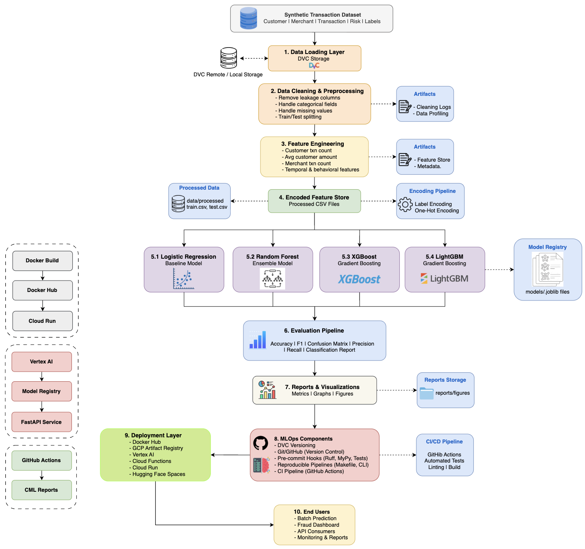

# Fraud Anomaly Classification & Behavioral Analytics

Scalable machine learning system for multi-class fraud anomaly classification, transaction behavior analysis, and financial risk analytics.

## Team Information

- **Project Lead:** MergeDeployGraduate (nshastry@depaul.edu)
- **Team Members:**
    - Nishanth Shekhar Shastry
    - Mohammed Musaddiq Vavartar
    - Lohith Poola
    - Israail Ghazzal

## Project Overview

Fraud Anomaly Classification & Behavioral Analytics is an MLOps-focused machine learning project designed to classify financial transactions into multiple behavioral and fraud-risk categories.

Unlike traditional binary fraud detection systems, this project introduces a multi-class classification approach to better represent varying levels of transactional risk and suspicious activity.

The system processes synthetic financial transaction data containing customer behavior, merchant activity, temporal patterns, and transaction metadata. The project focuses on building a reproducible and scalable ML workflow using modern MLOps practices such as DVC, modular pipelines, reproducible preprocessing, feature engineering, version control, and experiment tracking.

The project currently includes:
- Reproducible preprocessing pipelines
- Feature engineering for behavioral analytics
- Logistic Regression baseline model
- Random Forest ensemble model experimentation
- DVC integration for dataset versioning
- Modular `src/`-based architecture
- Automated testing and linting support

## Dataset

**Source:** [Kaggle  Credit Card Transaction Fraud Detection](https://www.kaggle.com/datasets/orogunadebola/credit-card-transaction-dataset-fraud-detection)

## Detailed Description

This project focuses on building a scalable MLOps workflow for fraud anomaly classification and financial transaction behavior analysis using a synthetic credit card transaction dataset. The system is designed to support reproducible preprocessing, behavioral feature engineering, model experimentation, and evaluation through modular machine learning pipelines and modern MLOps practices such as DVC integration, automated testing, linting, and version control. The preprocessing pipeline includes data cleaning, categorical encoding, train-test splitting, and engineered behavioral features such as customer transaction frequency and merchant activity metrics to improve fraud pattern analysis. Phase 1 establishes the foundational architecture for future multi-class fraud anomaly classification while maintaining reproducibility, collaborative development standards, and scalable project organization.

The project focuses on exploratory data analysis and machine learning model development for credit card fraud detection using a synthetic transaction dataset. The EDA notebook was completed prior to modeling to develop a thorough understanding of the dataset structure, class imbalance, and fraud-related patterns before any modeling decisions were made. The analysis examined transaction amount distributions, categorical fraud rates, temporal patterns, and multivariate feature interactions, identifying transaction amount as the strongest individual fraud signal with a 7.8x gap between fraudulent and legitimate transactions, and elevated fraud rates in online transaction categories. These findings directly informed downstream feature engineering, preprocessing decisions, and model selection.

The machine learning notebook builds a complete fraud detection pipeline covering feature engineering, leakage prevention, class imbalance handling, model training, evaluation, threshold tuning, and model explainability. SMOTE was applied exclusively to the training set with a sampling strategy of 0.3 to address the severe class imbalance without leaking synthetic patterns into the test set. Four classification models were trained and compared Logistic Regression, Random Forest, LightGBM, XGBoost and evaluated using fraud-appropriate metrics including F1 Score, ROC-AUC, Precision-Recall curves, confusion matrices, and TimeSeriesSplit cross-validation. XGBoost achieved the strongest performance with a ROC-AUC of 0.9614 and F1 of 0.5829, with an optimal classification threshold of 0.60 identified through threshold tuning. SHAP was used to interpret the final model and identify the features most influential in fraud predictions. Trained models are versioned using DVC with date-stamped joblib filenames, per-model metadata JSON files that append results across runs, and only DVC pointer files committed to git to keep model binaries out of the repository.

This project included developing machine learning models through logistic regression for anomaly detection with respect to fraud cases. Four classes of fraud risk labeling was created to classify transaction risks into four classes  totally valid transactions, suspect but still valid transactions, lower level fraudulent transactions, and higher level fraudulent transactions  through the combination of fraud label and merchant risk rating. Two different models were developed where one was a basic logistic regression model while the other was an imbalanced logistic regression model with SMOTE data over-sampling technique. Five newly engineered features were added including the ratio of transaction amounts, merchant risk rating, and night time high-amount flagging to help improve the machine learning model. These models were then tested using 5-Fold Stratified Cross-Validation and weighted F1-score. Models were then versioned and saved using DVC tool with Google drive as a remote storage device.

The exploration phase analyzed all the credit card transactions to understand the data modeling. The dataset revealed a heavy class imbalance with fraud rate approximately 1% which directly influenced modeling decisions. Transaction behavior was examined across time, location, spending patterns and customer demographics to surface meaningful signals. Rolling spend and frequency windows, customer merchant distance, merchant category and transaction hour emerged as the strongest indicators of fraud. Visualization were generated throughout to support findings and guide feature selection for the model building phases. For the full detailed analysis, see the [Data Exploration Report](reports/phase1-data-exploration-report.md)

This contribution focuses on exploratory data analysis and machine learning model development for credit card fraud detection using a synthetic transaction dataset. The EDA notebook was completed prior to modeling to develop a thorough understanding of the dataset structure, class imbalance, and fraud-related patterns before any modeling decisions were made. The analysis examined transaction amount distributions, categorical fraud rates, temporal patterns, and multivariate feature interactions, identifying transaction amount as the strongest individual fraud signal with a 7.8× gap between fraudulent and legitimate transactions, and elevated fraud rates in online transaction categories. These findings directly informed downstream feature engineering, preprocessing decisions, and model selection.

The machine learning notebook builds a complete fraud detection pipeline covering feature engineering, leakage prevention, class imbalance handling, model training, evaluation, threshold tuning, and model explainability. SMOTE was applied exclusively to the training set with a sampling strategy of 0.3 to address the severe class imbalance without leaking synthetic patterns into the test set. Four classification models were trained and compared — Logistic Regression, Random Forest, LightGBM, and XGBoost — and evaluated using fraud-appropriate metrics including F1 Score, ROC-AUC, Precision-Recall curves, confusion matrices, and TimeSeriesSplit cross-validation. XGBoost achieved the strongest performance with a ROC-AUC of 0.9614 and F1 of 0.5829, with an optimal classification threshold of 0.60 identified through threshold tuning. SHAP was used to interpret the final model and identify the features most influential in fraud predictions. Trained models are versioned using DVC with date-stamped joblib filenames, per-model metadata JSON files that append results across runs, and only DVC pointer files committed to git to keep model binaries out of the repository.

## Transaction Classes

| Label | Description |
|---|---|
| TT | Fully legitimate transaction |
| TF | Legitimate transaction with suspicious behavior |
| FT | Fraudulent transaction with lower financial impact |
| FF | Fraudulent transaction with high financial impact |

## Key Objectives

- Build a scalable fraud anomaly classification pipeline
- Analyze customer and merchant behavioral patterns
- Compare baseline and ensemble ML models
- Establish reproducible MLOps workflows for future deployment

## Dataset Information

This project uses a synthetic financial transaction dataset designed for fraud analytics and behavioral risk modeling.

### Dataset Characteristics

- 43 total features
- Synthetic transaction records
- Customer demographic information
- Merchant activity information
- Transaction behavioral metrics
- Temporal transaction features
- Fraud labels and risk indicators

> **Scalability Note:** Current Phase 1 experimentation uses a sampled dataset of approximately 100K transaction records to accelerate preprocessing, experimentation, and model benchmarking. Future phases of the project will expand the pipeline to support datasets exceeding 1 million transaction records in order to evaluate scalability, pipeline efficiency, and model performance under larger data workloads.

### Key Feature Categories

#### Customer Features
- Gender
- Age
- Job
- Customer transaction frequency
- Average spending behavior

#### Merchant Features
- Merchant name
- Merchant transaction counts
- Merchant risk scores

#### Transaction Features
- Transaction amount
- Transaction category
- Transaction timestamps
- Weekend/night indicators

### Target Variable

Current Phase 1 experimentation uses the binary `is_fraud` target as the baseline benchmark for fraud detection.

The project is designed to evolve toward a future multi-class fraud anomaly classification system with the following planned categories:

| Label | Description |
|---|---|
| TT | Fully legitimate transaction |
| TF | Legitimate transaction with suspicious behavior |
| FT | Fraudulent transaction with lower financial impact |
| FF | Fraudulent transaction with high financial impact |

## Architecture Diagram

The following architecture represents the end-to-end MLOps workflow implemented for fraud anomaly classification and behavioral analytics.



## Phase Deliverables

### Phase 1: Project Design & Model Development
- See [PHASE1.md](PHASE1.md) for detailed checklist

### Phase 2: Containerization & Monitoring
- See [PHASE2.md](PHASE2.md) for detailed checklist

### Phase 3: CI/CD & Deployment
- See [PHASE3.md](PHASE3.md) for detailed checklist

## Setup Instructions

### Prerequisites
- Python 3.11+ installed
- Git installed
- (Optional) Docker and Docker Compose

### Installation

**Option 1: Using uv (recommended - faster)**
```bash
pip install uv
uv pip install -r requirements.txt
```

**Option 2: Using pip**
```bash
pip install -U pip
pip install -r requirements.txt
```

### Development Setup

```bash
# Install development dependencies
pip install -r requirements_dev.txt

# Set up pre-commit hooks
pre-commit install

# Run tests to verify setup
pytest tests/
```

### Running the Pipeline

```bash
# Prepare data
make data

# Train the model
make train

# Generate predictions
make predict

# See all available commands
make help
```

## Docker Containerization (Phase 2)

Phase 2 operationalized the fraud detection platform using Docker and Docker Compose to provide reproducible machine learning workflows across environments.

### Docker Features

* Multi-stage Docker build
* Reproducible Python 3.11 environment
* MLflow-compatible runtime
* Containerized preprocessing and training
* Persistent artifact mounting support
* Docker Compose orchestration

### Build Docker Image

```bash
docker compose build --no-cache
```

### Run Containerized Pipeline

```bash
docker compose up
```

### Run in Detached Mode

```bash
docker compose up -d
```

### Stop Containers

```bash
docker compose down
```

### Persistent Volume Mounts

The Docker workflow mounts local project directories into the container to preserve:

* trained models
* MLflow artifacts
* processed datasets
* generated reports

### Docker Runtime Validation

The following workflows were successfully validated inside Docker:

* Logistic Regression
* Random Forest
* LightGBM
* XGBoost
* SMOTE preprocessing workflows

Container execution completed successfully with:

```text
exited with code 0
```

### Docker Troubleshooting

The following dependency/runtime issues were identified and resolved during containerization:

* missing make dependency
* missing curl dependency
* missing git dependency
* missing libgomp1 runtime dependency for LightGBM

For additional operational details, see:

* [PHASE2.md](PHASE2.md)

### MLflow Experiment Tracking (Phase 2)

MLflow is integrated into the training pipeline for experiment tracking.

**Start MLflow UI:**
```bash
mlflow ui --backend-store-uri sqlite:///mlflow.db
# Open: http://127.0.0.1:5000
```

**Run experiments:**
```bash
# Default experiment
python -m mlops_frauddetection.train_model

# Custom hyperparameters
python -m mlops_frauddetection.train_model --pipeline lr --max-iter 500
python -m mlops_frauddetection.train_model --n-estimators-rf 100 --n-estimators-lgb 200
```

**4 experiments tracked:**

| Experiment | Key Parameters |
|---|---|
| fraud-anomaly-detection | max_iter=1000, RF=200, LGB=500 |
| fraud-anomaly-detection-v2-max-iter500 | max_iter=500, LR only |
| fraud-anomaly-detection-v3-rf100-lgb200 | RF=100, LGB=200 |
| fraud-anomaly-detection-v4-rf300-lgb100 | RF=300, LGB=100 |

## Technology Stack

### Core Dependencies
- **numpy** >= 1.26.0 - Numerical computing
- **pandas** >= 2.2.0 - Data manipulation
- **scikit-learn** >= 1.5.0 - Machine learning algorithms
- **matplotlib** >= 3.9.0 - Visualization
- **tqdm** >= 4.66.0 - Progress bars
- **pyyaml** >= 6.0 - Configuration files
### Experiment Tracking
- **mlflow** >= 2.16.0 - MLflow experiment tracking
### Configuration Management
- **hydra-core** >= 1.3.0 - Hydra configuration framework
- **omegaconf** >= 2.3.0 - Hierarchical configuration
### Data Version Control
- **dvc** >= 3.55.0 - Data Version Control

### Development Tools
- **pytest** >= 8.0 - Testing framework
- **pytest-cov** >= 5.0 - Code coverage
- **ruff** >= 0.6.0 - Linting and formatting
- **mypy** >= 1.11 - Static type checking
- **pre-commit** >= 3.8 - Git hooks framework

## Project Structure

This template uses the modern **`src/` layout** — the importable package lives in `src/mlops_frauddetection/`, decoupled from the repository root. That forces `pip install -e .` before imports work, which catches packaging bugs early.

```
mlops_frauddetection/                  # Repository root
├── src/
│   └── mlops_frauddetection/          # Importable Python package
│       ├── __init__.py                # Version + package metadata
│       ├── config.py                  # Paths & typed config (PROJECT_ROOT, TrainingConfig, ...)
│       ├── logging_config.py          # setup_logging() + get_logger()
│       ├── data/
│       │   ├── __init__.py
│       │   ├── loaders.py             # load_raw / load_processed / save_processed
│       │   └── make_dataset.py        # Raw → processed pipeline CLI
│       ├── features/
│       │   ├── __init__.py
│       │   └── build_features.py      # Feature engineering
│       ├── models/
│       │   ├── __init__.py
│       │   ├── base.py                # BaseModel ABC (fit/predict/save/load)
│       │   └── model.py               # Concrete Model scaffold
│       ├── evaluation/
│       │   ├── __init__.py
│       │   └── metrics.py             # classification_report, regression_report
│       ├── visualization/
│       │   ├── __init__.py
│       │   └── visualize.py           # Plot helpers
│       ├── utils/
│       │   ├── __init__.py
│       │   ├── io.py                  # JSON helpers
│       │   └── seed.py                # set_seed for reproducibility
│       ├── train_model.py             # Training CLI
│       └── predict_model.py           # Inference CLI
├── tests/                             # Unit and integration tests
│   ├── conftest.py
│   └── test_model.py
├── data/
│   ├── raw/                           # Immutable raw data
│   └── processed/                     # Cleaned, transformed data
├── models/                            # Trained model artifacts (.joblib)
├── notebooks/                         # Jupyter notebooks for exploration
├── reports/
│   └── figures/                       # Generated analysis and figures
├── docs/                              # MkDocs documentation
│   ├── mkdocs.yml
│   ├── index.md
│   ├── getting_started.md
│   └── api.md
├── dockerfiles/                       # Docker configuration
│   └── Dockerfile
├── configs/                           # Hydra configuration (if selected)
│   └── config.yaml
├── api/                               # FastAPI service (if selected)
├── .github/workflows/                 # GitHub Actions CI/CD
│   └── ci.yml
├── PHASE1.md                          # Phase 1 deliverables checklist
├── PHASE2.md                          # Phase 2 deliverables checklist
├── PHASE3.md                          # Phase 3 deliverables checklist
├── .pre-commit-config.yaml            # Pre-commit hooks (Ruff, mypy)
├── Makefile                           # Common commands
├── docker-compose.yaml                # Docker Compose setup
├── pyproject.toml                     # Project config & dependencies
├── requirements.txt                   # Runtime dependencies
├── requirements_dev.txt               # Development dependencies
├── LICENSE
└── README.md
```

### Our Current Project stucture

```
.
├── LICENSE
├── Makefile
├── PHASE1.md
├── PHASE2.md
├── PHASE3.md
├── README.md
├── configs
│   ├── README.md
│   ├── config.yaml
│   └── experiment
│       ├── default_experiment.yaml
│       ├── ensemble_only.yaml
│       └── lr_only.yaml
├── data
│   ├── README.md
│   ├── processed
│   │   ├── X_test.csv
│   │   ├── X_train.csv
│   │   ├── y_test.csv
│   │   └── y_train.csv
│   └── raw
│       ├── data_100k.csv
│       └── data_1M.csv
├── data.dvc
├── docker-compose.yaml
├── dockerfiles
│   ├── Dockerfile
│   └── README.md
├── docs
│   ├── PHASE1.md
│   ├── PHASE2.md
│   ├── PHASE3.md
│   ├── README.md
│   ├── api.md
│   ├── getting_started.md
│   ├── index.md
│   ├── mkdocs.yml
│   └── source
├── mlflow.db
├── models
│   ├── LR_SMOTE_model_metadata.json
│   ├── README.md
│   ├── RGhazzal_lightgbm_metadata.json
│   ├── RGhazzal_logisticregression_metadata.json
│   ├── RGhazzal_randomforest_metadata.json
│   ├── RGhazzal_xgboost_metadata.json
│   ├── lightgbm_20260507.joblib
│   ├── lightgbm_20260507.joblib.dvc
│   ├── lightgbm_20260520.joblib
│   ├── lightgbm_20260520.joblib.dvc
│   ├── lightgbm_20260521.joblib
│   ├── lightgbm_20260521.joblib.dvc
│   ├── lightgbm_20260522.joblib
│   ├── logistic_regression_20260507.joblib
│   ├── logistic_regression_20260507.joblib.dvc
│   ├── logisticregression_20260520.joblib
│   ├── logisticregression_20260520.joblib.dvc
│   ├── logisticregression_20260521.joblib
│   ├── logisticregression_20260521.joblib.dvc
│   ├── logisticregression_20260522.joblib
│   ├── lr_balanced_20260520.joblib
│   ├── lr_balanced_20260520.joblib.dvc
│   ├── lr_balanced_20260521.joblib
│   ├── lr_balanced_20260521.joblib.dvc
│   ├── lr_balanced_20260522.joblib
│   ├── lr_smote_20260520.joblib
│   ├── lr_smote_20260520.joblib.dvc
│   ├── lr_smote_20260521.joblib
│   ├── lr_smote_20260521.joblib.dvc
│   ├── lr_smote_20260522.joblib
│   ├── preprocessor_20260507.joblib
│   ├── preprocessor_20260507.joblib.dvc
│   ├── random_forest_20260507.joblib
│   ├── random_forest_20260507.joblib.dvc
│   ├── randomforest_20260520.joblib
│   ├── randomforest_20260520.joblib.dvc
│   ├── randomforest_20260521.joblib
│   ├── randomforest_20260521.joblib.dvc
│   ├── randomforest_20260522.joblib
│   ├── xgboost_20260507.joblib
│   ├── xgboost_20260507.joblib.dvc
│   ├── xgboost_20260520.joblib
│   ├── xgboost_20260520.joblib.dvc
│   ├── xgboost_20260521.joblib
│   ├── xgboost_20260521.joblib.dvc
│   └── xgboost_20260522.joblib
├── notebooks
│   ├── 1.0-Musaddiq-logistic-regression.ipynb
│   ├── 1.0-lohith-data-exploration.ipynb
│   ├── 1.0-nishanthshastry-data-sample.ipynb
│   ├── 1.0-rghazzal-exploratory-data-analysis.ipynb
│   ├── 1.0-rghazzal-machine-learning-models.ipynb
│   └── README.md
├── predictions.csv
├── profile.html
├── profile.json
├── pyproject.toml
├── reports
│   ├── README.md
│   ├── cprofile_training.prof
│   ├── cprofile_training_output.txt
│   ├── figures
│   │   ├── RGazzal_eda_01_target_variable_is_fraud.svg
│   │   ├── RGazzal_eda_02_univariate_transaction_amount.svg
│   │   ├── RGazzal_eda_03_univariate_categorical_features_All.svg
│   │   ├── RGazzal_eda_04_top_15_states_transaction_volume.png
│   │   ├── RGazzal_eda_04_top_15_states_transaction_volume.svg
│   │   ├── RGazzal_eda_05_univariate_temporal_features.svg
│   │   ├── RGazzal_eda_06_univariate_numeric_feature_distributions.svg
│   │   ├── RGazzal_eda_07_bivariate_transaction_amount_vs_is_fraud.svg
│   │   ├── RGazzal_eda_08_bivariate_category_vs_is_fraud_All.svg
│   │   ├── RGazzal_eda_09_bivariate_temporal_features_vs_is_fraud_All.svg
│   │   ├── RGazzal_eda_10_demographic_velocity_features_vs_is_fraud.svg
│   │   ├── RGazzal_eda_11_correlation_matrix_key_numeric_features.svg
│   │   ├── RGazzal_eda_12_bivariate_category_time_of_day_vs_is_fraud_All.svg
│   │   ├── RGazzal_eda_13_median_transaction_amount_legitimate_vs_fraud_by_category.svg
│   │   ├── RGazzal_eda_14_amount_vs_merchant_risk_fraud_vs_legitimate_All.svg
│   │   ├── RGazzal_eda_15_pair_plot_key_features_by_fraud_class_All.svg
│   │   ├── RGazzal_eda_16_fraud_rate_category_weekday_weekend.svg
│   │   ├── Scalene-scripts_profile_training.py-1.png
│   │   ├── Scalene-scripts_profile_training.py-2.png
│   │   ├── amount_distribution.png
│   │   ├── avg_spend_per_category.png
│   │   ├── class_balance.png
│   │   ├── correlation_heatmap.png
│   │   ├── customer_average_spend_window.png
│   │   ├── customer_location_scatter.png
│   │   ├── customer_transaction_count.png
│   │   ├── cutomer_age_distribution_by_class.png
│   │   ├── docker1.png
│   │   ├── docker2.png
│   │   ├── docker3.png
│   │   ├── docker4.png
│   │   ├── docker5.png
│   │   ├── fraud_rate_by_day_of_week.png
│   │   ├── fraud_rate_by_merchant_category.png
│   │   ├── fraud_risk_across_age_groups.png
│   │   ├── heatmap_days_of_week_vs_hour.png
│   │   ├── label_distribution.png
│   │   ├── lightgbm_classification_report.txt
│   │   ├── logisticregression_classification_report.txt
│   │   ├── m1_confusion_matrix.png
│   │   ├── mlflow_all_experiments.png
│   │   ├── mlflow_artifact_2.png
│   │   ├── mlflow_cm_lr_balanced.png
│   │   ├── mlflow_cm_lr_smote.png
│   │   ├── mlflow_compare_1.png
│   │   ├── mlflow_compare_2.png
│   │   ├── mlflow_compare_exp3_exp4_runs.png
│   │   ├── mlflow_compare_exp3_exp_4_lgboost_1.png
│   │   ├── mlflow_compare_exp3_exp_4_lgboost_2.png
│   │   ├── mlflow_compare_exp3_exp_4_lgboost_3.png
│   │   ├── mlflow_compare_exp3_exp_4_lr_balanced_1.png
│   │   ├── mlflow_compare_exp3_exp_4_lr_balanced_2.png
│   │   ├── mlflow_compare_exp3_exp_4_lr_balanced_3.png
│   │   ├── mlflow_exp1_exp_2_compare1.png
│   │   ├── mlflow_exp1_exp_2_compare2.png
│   │   ├── mlflow_exp1_exp_2_smote.png
│   │   ├── mlflow_exp1_exp_2_smote_2.png
│   │   ├── mlflow_exp_1_exp_2.png
│   │   ├── mlflow_experiment.png
│   │   ├── mlflow_experiment_3_runs.png
│   │   ├── mlflow_experiments_4_runs.png
│   │   ├── mlflow_run_detail_1.png
│   │   ├── mlflow_run_metrices.png
│   │   ├── mlflow_runs.png
│   │   ├── mlflow_runs_artifact_1.png
│   │   ├── model_comparison_confusion.png
│   │   ├── pipeline_architecture.png
│   │   ├── randomforest_classification_report.txt
│   │   ├── test_state.png
│   │   ├── total_fraud_volume_by_state.png
│   │   ├── transactions_by_hour_of_day.png
│   │   └── xgboost_classification_report.txt
│   ├── monitoring
│   │   ├── ensemble_pipeline_resource_usage.csv
│   │   └── lr_pipeline_resource_usage.csv
│   ├── phase1-data-exploration-report.md
│   ├── phase2-Mlflow-experiment-comparision-report.md
│   ├── phase2-monitoring-debugging.md
│   ├── profiling_output.html
│   ├── profiling_output.json
│   └── profiling_output.txt
├── requirements.txt
├── requirements_dev.txt
├── scripts
│   ├── cprofile.py
│   └── profile_training.py
├── src
│   ├── mlops_frauddetection
│   │   ├── __init__.py
│   │   ├── config.py
│   │   ├── data
│   │   │   ├── __init__.py
│   │   │   ├── exceptions.py
│   │   │   ├── loaders.py
│   │   │   └── make_dataset.py
│   │   ├── evaluation
│   │   │   ├── __init__.py
│   │   │   └── metrics.py
│   │   ├── features
│   │   │   ├── __init__.py
│   │   │   └── build_features.py
│   │   ├── logging_config.py
│   │   ├── models
│   │   │   ├── __init__.py
│   │   │   ├── base.py
│   │   │   ├── fraud_models.py
│   │   │   └── model.py
│   │   ├── monitoring
│   │   │   ├── __init__.py
│   │   │   └── system_monitoring.py
│   │   ├── predict_model.py
│   │   ├── train_model.py
│   │   ├── utils
│   │   │   ├── __init__.py
│   │   │   ├── io.py
│   │   │   └── seed.py
│   │   └── visualization
│   │       ├── __init__.py
│   │       ├── eda_generated_report.py
│   │       └── visualize.py
│   └── mlops_frauddetection.egg-info
│       ├── PKG-INFO
│       ├── SOURCES.txt
│       ├── dependency_links.txt
│       ├── requires.txt
│       └── top_level.txt
└── tests
    ├── README.md
    ├── __init__.py
    ├── conftest.py
    └── test_model.py
```

### Why `src/` layout?

| | `src/` layout (this template) | Flat layout |
|---|---|---|
| Forces `pip install -e .` before import | ✅ | ❌ |
| Catches packaging bugs early | ✅ | ❌ |
| Adopted by | attrs, httpx, pydantic, flask, sqlalchemy | Older data-science templates |

Data and model artifacts are accessed via the constants in `mlops_frauddetection.config` (`PROJECT_ROOT`, `DATA_DIR`, `MODELS_DIR`, …) rather than relative paths — code is independent of where you invoke it from.

## Common Commands

```bash
# Install package + runtime dependencies (editable install)
make install

# Install dev tools + pre-commit hooks
make dev

# Run linting and formatting checks
make lint

# Auto-format code
make format

# Run tests
make test

# Clean up build artifacts
make clean

# Docker operations
make docker_build
make docker_run

# Serve documentation locally
make docs
```

## Phase 2 Operational Updates

Phase 2 introduced operational MLOps improvements including:

* Docker containerization
* Docker Compose orchestration
* runtime validation
* MLflow-compatible execution workflows
* structured logging integration
* preprocessing validation
* reproducible training execution

### Phase 2 Deliverables

| Component                         | Status    |
| --------------------------------- | --------- |
| Docker Containerization           | Completed |
| Docker Compose Runtime Validation | Completed |
| Environment Reproducibility       | Completed |
| Persistent Artifact Mounting      | Completed |
| Logging Validation                | Completed |
| MLflow Runtime Compatibility      | Completed |
| MLflow Experiment Tracking        | Completed |
| Framework profilers               | Completed |
| Modular ML Pipeline               | Completed |

### Related Documentation

* [PHASE2.md](PHASE2.md)
* [docs/PHASE2.md](docs/PHASE2.md)

## Results & Visualizations

### Generated Outputs

The project currently generates:
- Label distribution analysis
- Confusion matrices
- Model evaluation summaries
- Comparative model performance metrics

### Example Results

| Model | Train Accuracy | Test Accuracy | Test F1 |
|---|---|---|---|
| Logistic Regression | 66.12% | 65.28% | 0.6555 |
| SMOTE + Logistic Regression | 51.33% | 60.77% | 0.6149 |

Generated figures are stored in:

```bash
reports/figures/
```

## Contribution Summary

- [x] Team members assigned
- [x] Development environment configured
- [x] Initial data exploration completed
- [x] Feature engineering implemented
- [x] DVC pipeline initialized
- [x] Baseline model established
- [x] Evaluation metrics defined
- [x] Documentation updated
- [x] Tests passing successfully
- [x] Code reviewed and merged

## Team Contributions - Phase 1

| Team Member | Responsibilities |
|---|---|
| Nishanth Shastry | DVC setup, preprocessing pipeline, feature engineering, project documentation, code review |
| Raail | Logistic Regression, Random Forest, LightGBM, XGBoost implementation & evaluation, project documentation  |
| Musaddiq | Logistic Regression baseline model, feature engineering, project documentation, code review |
| Lohith | Exploratory Data Analysis, visualization, project documentation, document review |

## Team Contributions - Phase 2

| Team Member | Responsibilities |
|---|---|
| Nishanth Shastry | Docker containerization, Dockerfile, Docker Compose, Section 1,7|
| Israail Ghazzal | Monitoring (psutil/MLflow system metrics), Logging with Rich, Section 5, 6.1, 7|
| Musaddiq Vavartar | MLflow experiment tracking (4 experiments), profiling with cProfile, modular ML pipeline refactoring, Section 3.2 & 4,7|
| Lohith Poola | cProfile profiling, Hydra configuration management, Section 2 & 3.1, 7  |


## References

- [Project Documentation](docs/index.md)
- [Phase 1 — Project Design & Model Development](PHASE1.md)
- [Phase 1 — Exploratory Data Analysis Report](reports/phase1-data-exploration-report.md)
- [Phase 2 — Containerization & Monitoring](PHASE2.md)
- [Phase 3 — CI/CD & Deployment](PHASE3.md)

## License

This project is licensed under the MIT License. See [LICENSE](LICENSE) for details.
