# GCP Deployment Report  Phase 3

## 3.1 GCP Artifact Registry

### What was done
Built a Docker Repository in GCP Artifact Registry and pushed the Fraud Detection ML pipeline Docker image into it. The Docker image `nshastry00/fraud-detection-mlops:latest` was pulled from Docker Hub and then tagged with GCP tag and pushed into Artifact Registry in location `us-central1`.

### Steps
1. Activated artifact registry API on Google Cloud Platform (GCP)
2. Set up a repository named `fraud-detection`, in Docker format, within `us-central1`
3. Authenticated Docker for pushing Docker image into GCP through `gcloud auth configure-docker`
4. Pulled Docker image from Docker hub (`nshastry00/fraud-detection-mlops:latest`)
5. Added tag to

### Files
- `scripts/push_to_artifact_registry.sh`  automates all steps above

### Evidence

**Step 1  Artifact Registry repository created in GCP Console:**
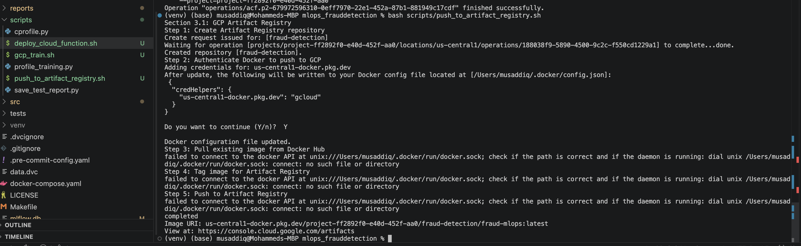

**Step 2  Repository details showing Docker format and location:**
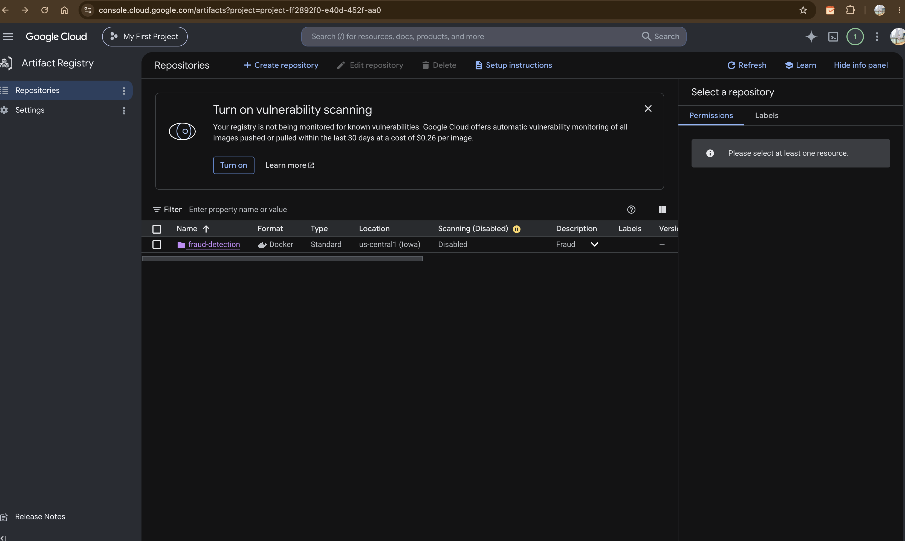

**Step 3  Terminal output showing successful image push:**
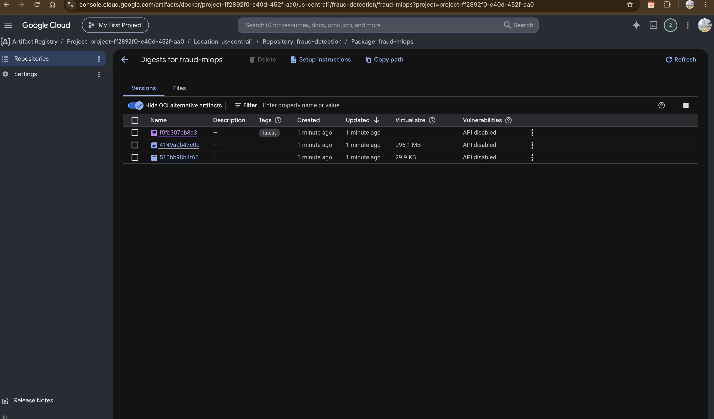

---

## 3.2 Custom Training Job on GCP

### What was done
Submitted a custom training job in Vertex AI using the Docker image which is present in Artifact Registry. Training data and models will be stored in GCS bucket `fraud-detection-mlops-data`. The training job will run Pipeline A (Logistic Regression) using Hydra config.

### Steps
1. Created GCS bucket `fraud-detection-mlops-data` in `us-central1`
2. Loaded all 4 CSV data into `gs://fraud-detection-mlops-data/data/processed/`
3. Loaded all 6 model files `.joblib` into `gs://fraud-detection-mlops-data/models/`
4. Added `train_model.py` to read the data from GCS in case `GCS_DATA_PATH` environment variable is set using the `google-cloud-storage` library
5. Submitted Vertex AI training job through YAML file with required configuration settings and environmental variables
6. Training was successful within 8 minutes 32 seconds

### Files
- `scripts/gcp_train.sh`  creates bucket, uploads data/models, submits training job
- `src/mlops_frauddetection/train_model.py`  modified `load_data()` to support GCS download

### Job Details
| Field | Value |
|---|---|
| Job ID | 7785243246136918016 |
| Display Name | fraud-detection-training-20260606-1604 |
| Status |  Finished |
| Duration | 8 min 32 sec |
| Region | us-central1 |
| Machine Type | n1-standard-4 |
| Container | us-central1-docker.pkg.dev/project-ff2892f0-e40d-452f-aa0/fraud-detection/fraud-mlops:latest |

### Evidence

**GCS bucket showing uploaded data files:**
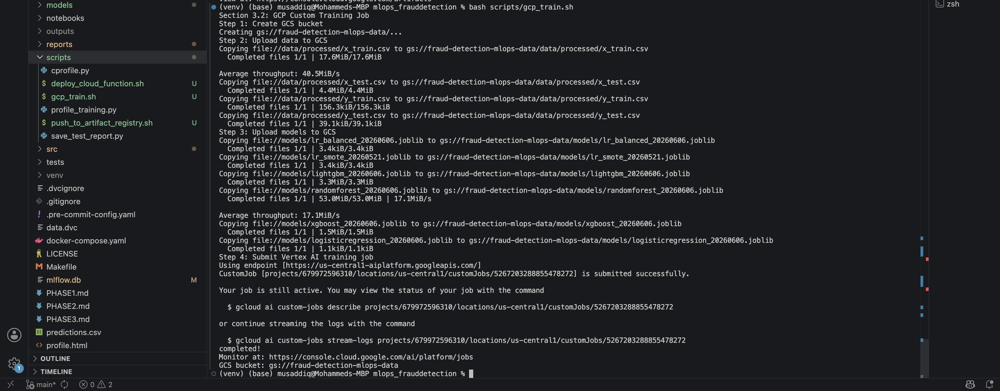

**GCS bucket showing uploaded model files:**
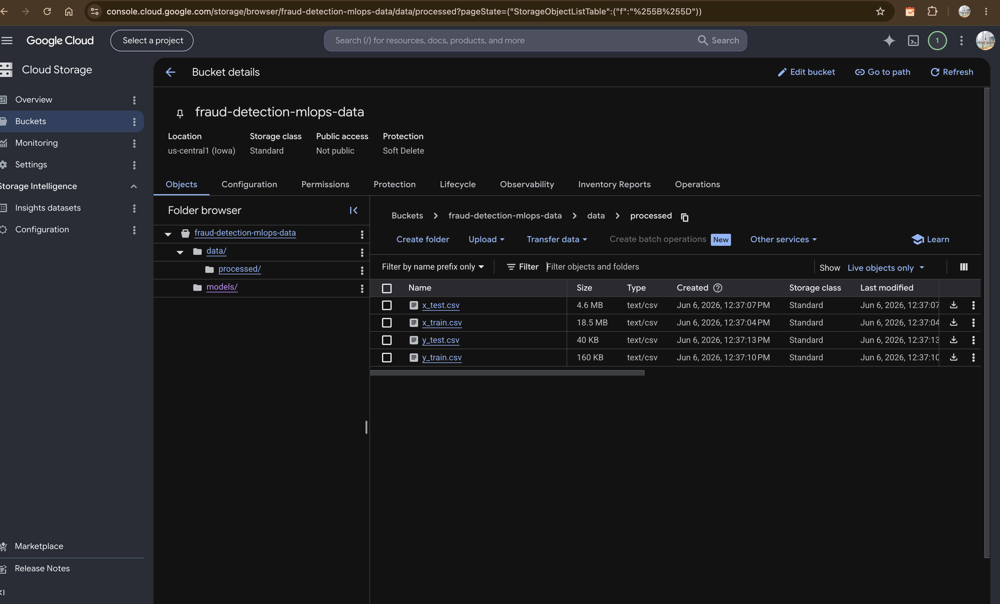

**Vertex AI training job submitted and running:**
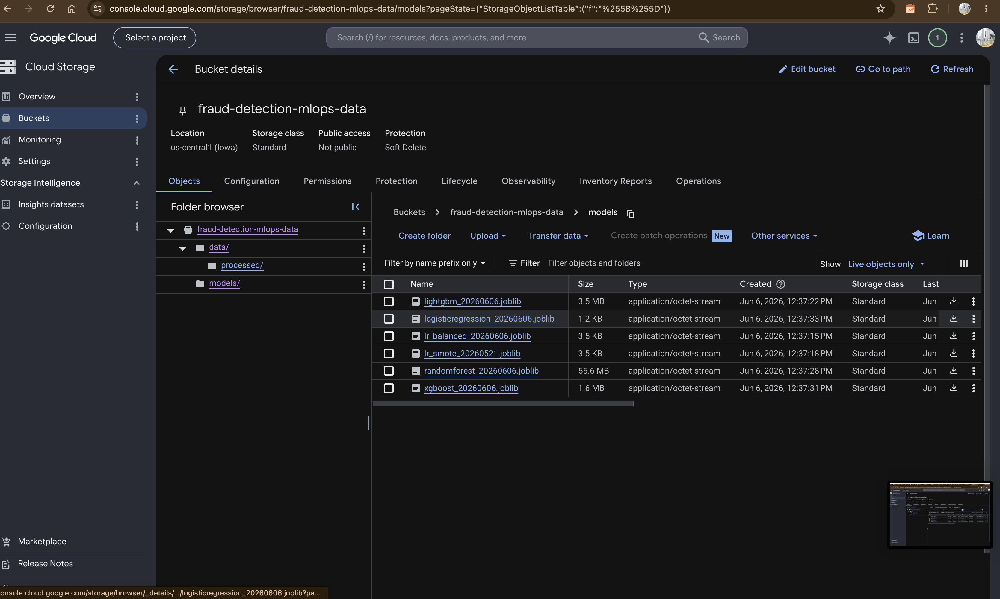

**All training jobs history  final job status Finished:**
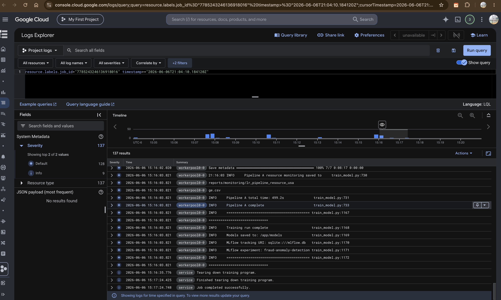

**Training job completed successfully (8 min 32 sec):**
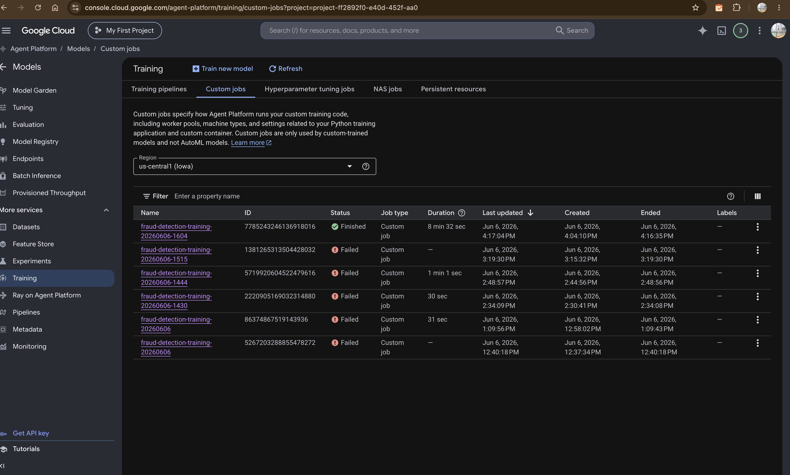

---

## 3.3 FastAPI + GCP Cloud Functions

### What was done
Built a FastAPI service exposing `/predict` and related endpoints for all 6 fraud detection models across Pipeline A (4-class) and Pipeline B (binary). The API loads models dynamically from GCS bucket on first request and caches them in memory. Deployed to GCP Cloud Functions Gen2 with 2GB memory and 300s timeout.

### API Design

| Endpoint | Method | Description |
|---|---|---|
| `/` | GET | API info and version |
| `/health` | GET | Health check, model status, GCS bucket info |
| `/models` | GET | List all 6 available models |
| `/predict` | POST | Default prediction using lr_balanced (4-class) |
| `/predict/simple` | POST | Simplified endpoint with 5 key features, rest default to 0 |
| `/predict/pipeline-a/lr_balanced` | POST | Pipeline A  4-class fraud risk |
| `/predict/pipeline-a/lr_smote` | POST | Pipeline A  4-class with SMOTE training |
| `/predict/pipeline-b/lightgbm` | POST | Pipeline B  binary Fraud/Legit |
| `/predict/pipeline-b/xgboost` | POST | Pipeline B  binary Fraud/Legit |
| `/predict/pipeline-b/randomforest` | POST | Pipeline B  binary Fraud/Legit |
| `/predict/pipeline-b/logisticregression` | POST | Pipeline B  binary Fraud/Legit |

### Pipeline A Output Labels (4-class)
| Label | Meaning |
|---|---|
| TT-Legit-Normal | Legitimate transaction, no suspicious signals |
| TF-Legit-Suspicious | Legitimate but suspicious signals present |
| FT-Fraud-LowRisk | Fraud at low-risk merchant |
| FF-Fraud-HighRisk | Fraud at high-risk merchant |

### Model Loading Architecture
```
Request  Cloud Functions
         _load_model() checks cache
         if not cached: download from gs://fraud-detection-mlops-data/models/
         cache in memory
         predict  return JSON response
```

### Files
- `api/main.py`  FastAPI application with all endpoints
- `api/requirements.txt`  dependencies for Cloud Functions
- `scripts/deploy_cloud_function.sh`  deployment script

### Deployment Details
| Field | Value |
|---|---|
| Function Name | fraud-detection-predict |
| Runtime | python311 |
| Memory | 2048MB |
| Timeout | 300s |
| Trigger | HTTP (unauthenticated) |
| Entry Point | fraud_predict |
| GCS Bucket | fraud-detection-mlops-data |

### Live URL
```
https://fraud-detection-predict-lj4hg275tq-uc.a.run.app
```

### Sample Requests and Responses

```bash
# Health check
curl https://fraud-detection-predict-lj4hg275tq-uc.a.run.app/health
```
```json
{"status":"healthy","model_loaded":true,"gcs_bucket":"fraud-detection-mlops-data","pipeline_a_models":["lr_balanced","lr_smote"],"pipeline_b_models":["lightgbm","randomforest","xgboost","logisticregression"]}
```

```bash
# List all models
curl https://fraud-detection-predict-lj4hg275tq-uc.a.run.app/models
```
```json
{"pipeline_a":["lr_balanced","lr_smote"],"pipeline_b":["lightgbm","randomforest","xgboost","logisticregression"],"all":["lr_balanced","lr_smote","lightgbm","randomforest","xgboost","logisticregression"],"source":"gs://fraud-detection-mlops-data/models/"}
```

```bash
# Predict high risk transaction (simplified)
curl -X POST "https://fraud-detection-predict-lj4hg275tq-uc.a.run.app/predict/simple?amt=5000&merchant_risk_30_day=28&trans_time_is_night=1&avg_amt_per_customer=50"
```
```json
{"model":"lr_balanced","pipeline":"A","prediction":3,"label":"FF-Fraud-HighRisk","risk_level":"HIGH"}
```

### Evidence

**FastAPI root endpoint:**
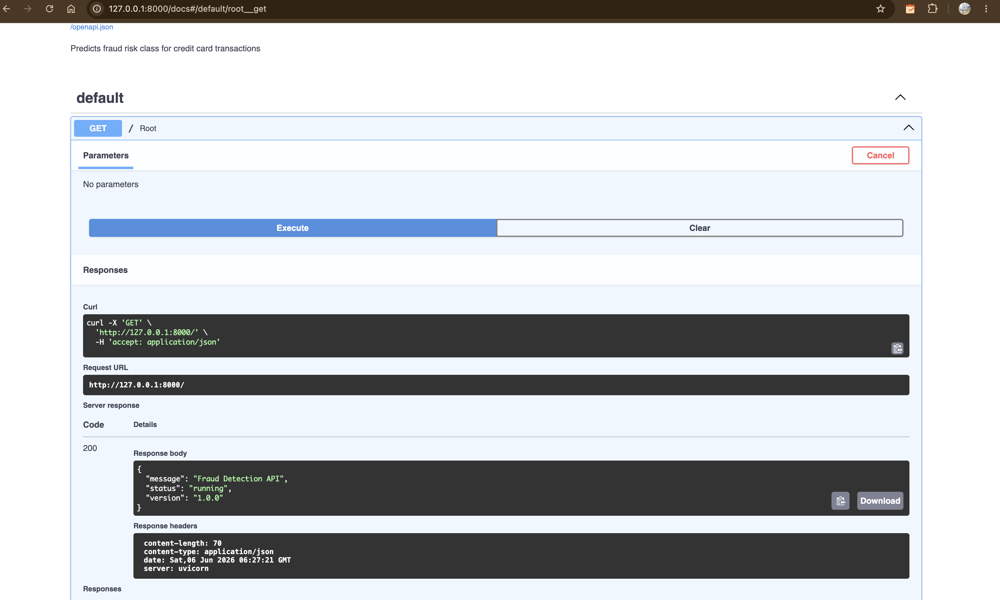

**FastAPI health endpoint showing all 6 models loaded:**
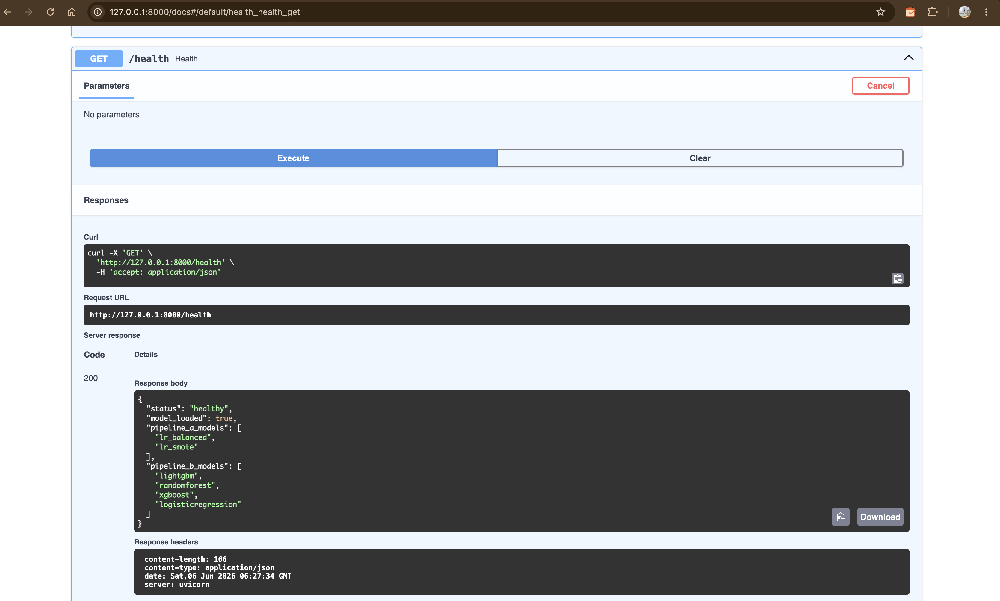

**FastAPI models endpoint listing all 6 models:**
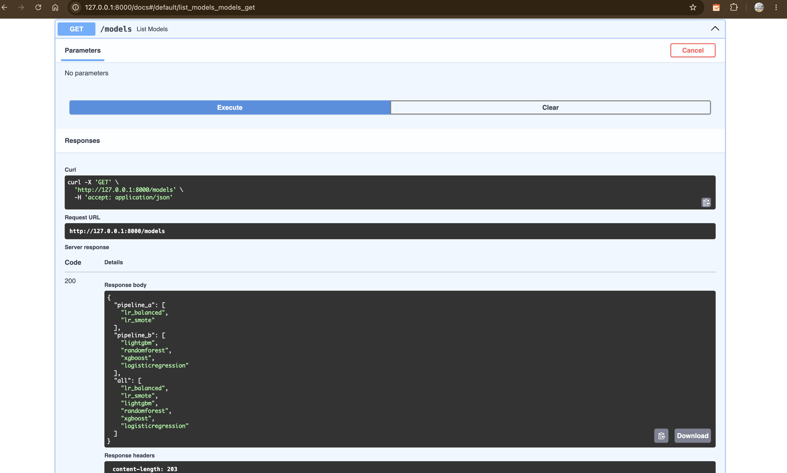

**FastAPI /predict endpoint  request body:**
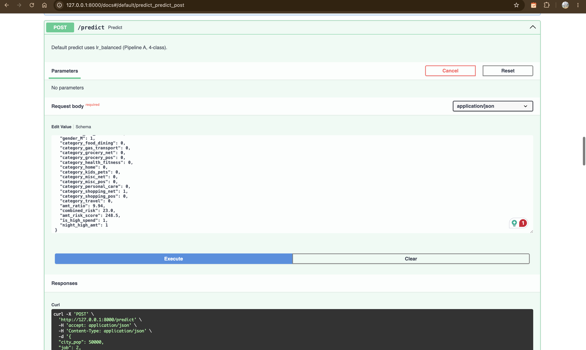

**FastAPI /predict endpoint  response showing FF-Fraud-HighRisk:**
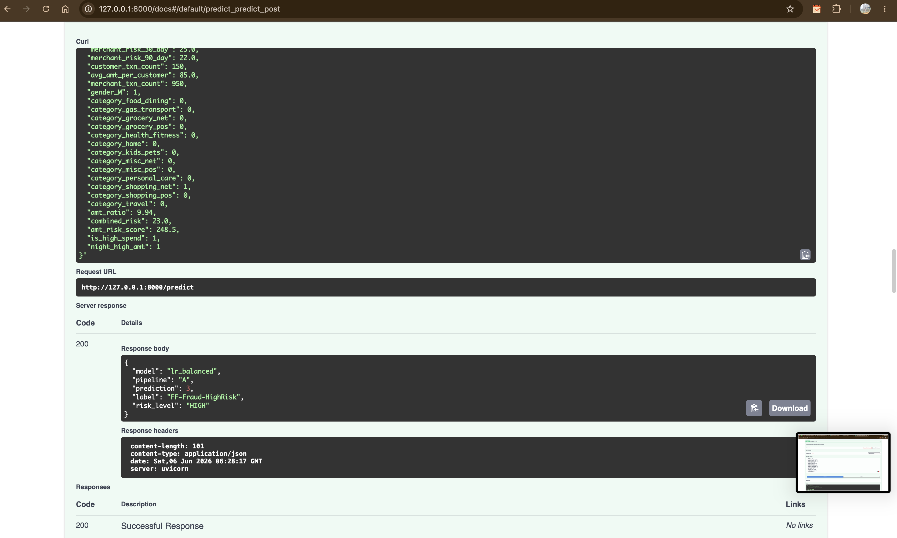

**Pipeline A lr_smote  request:**
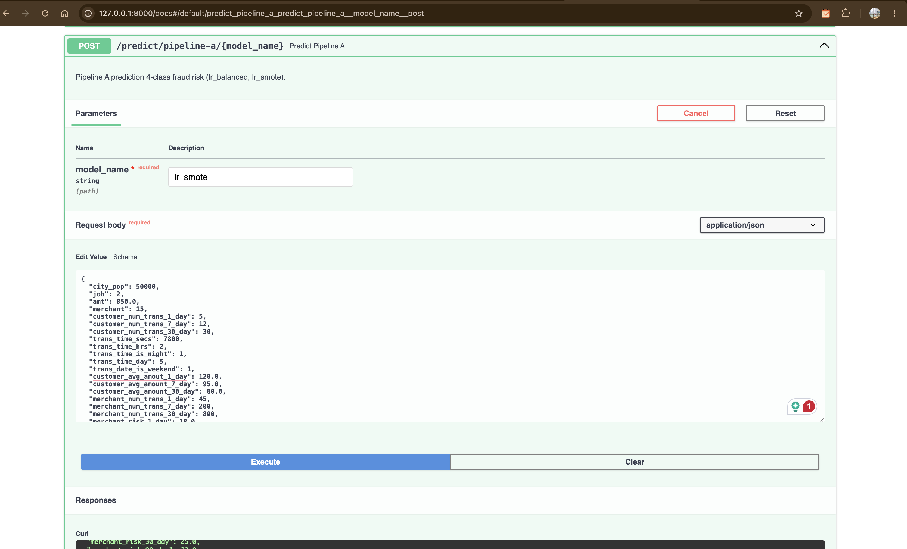

**Pipeline A lr_smote  response:**
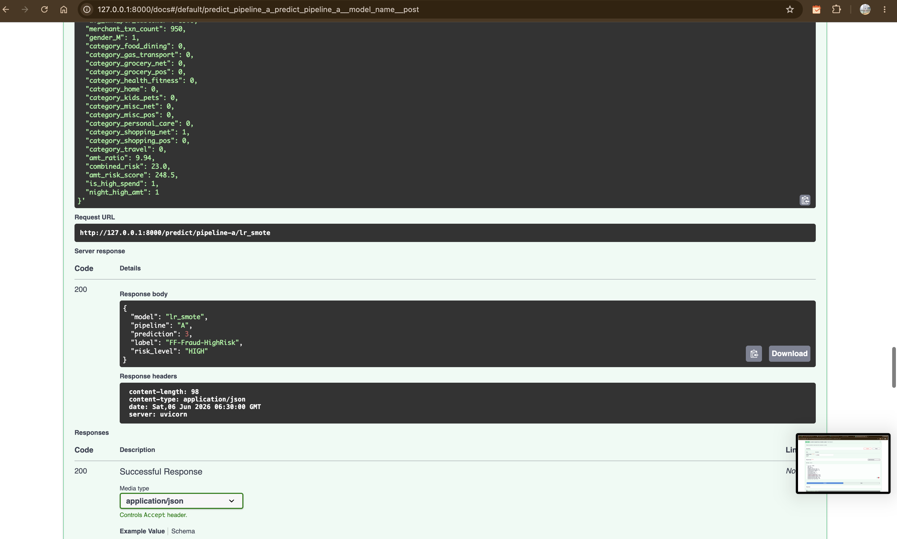

**Pipeline B Logistic Regression  request:**
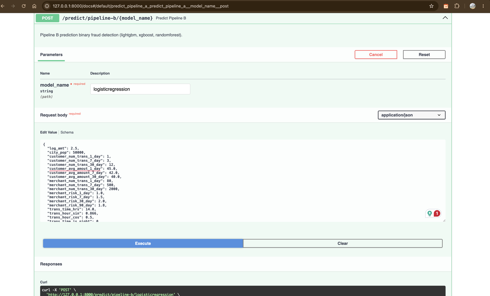

**Pipeline B Logistic Regression  response:**
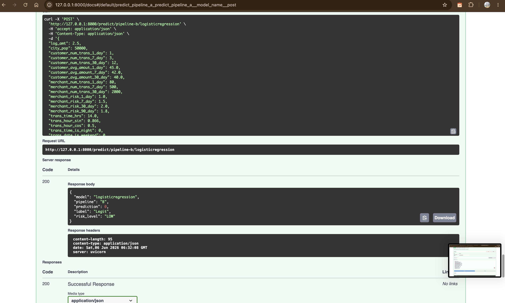

**Pipeline B XGBoost  request:**
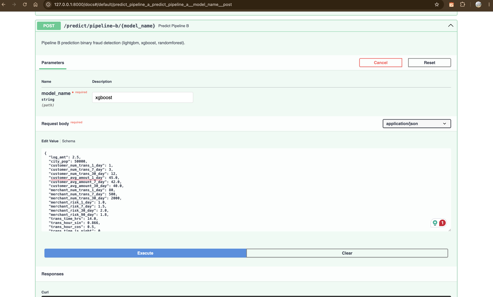

**Pipeline B XGBoost  response:**
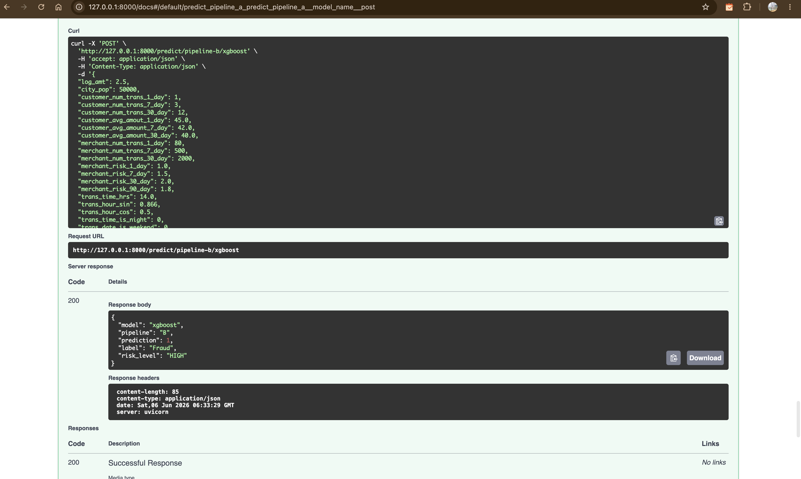

**Cloud Functions deployment in GCP Console:**
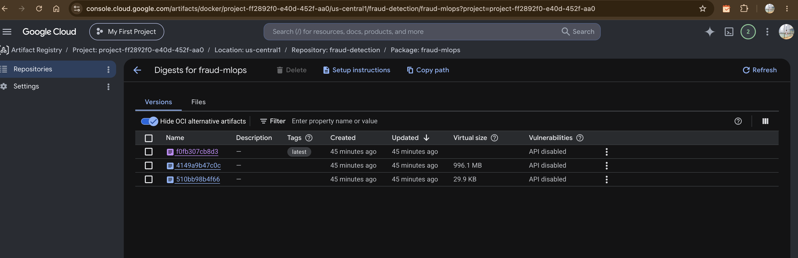

**Cloud Functions service details:**
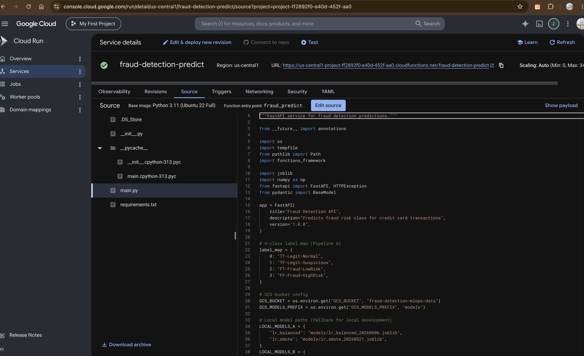

**Cloud Functions deployment terminal output:**
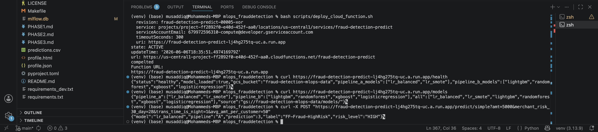

---

## 3.4 Dockerize & Deploy with GCP Cloud Run

### What was done
The Cloud Function Gen2 by GCP automatically deploys and manages the infrastructure through Cloud Run. This means that there is no need to create any Cloud Run deployment as it is done automatically by Cloud Functions Gen2 as the fraud detection FastAPI service runs as a managed service using Cloud Run with automatic scaling.

### Live Service URL
```
https://fraud-detection-predict-lj4hg275tq-uc.a.run.app
```

### Auto-scaling Configuration
| Setting | Value |
|---|---|
| Max instances | 34 |
| Max concurrency | 1 |
| Memory | 2048MB |
| CPU | 1 |
| Ingress | Allow all |

### Sample Request/Response
```bash
curl https://fraud-detection-predict-lj4hg275tq-uc.a.run.app/health
```
```json
{"status":"healthy","model_loaded":true,"gcs_bucket":"fraud-detection-mlops-data","pipeline_a_models":["lr_balanced","lr_smote"],"pipeline_b_models":["lightgbm","randomforest","xgboost","logisticregression"]}
```

### Evidence

**Cloud Run service running with ACTIVE status:**
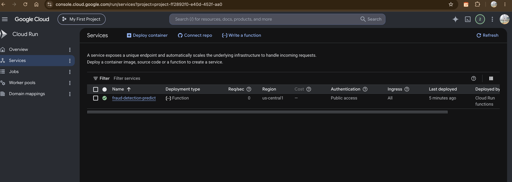

---

## 6.3 GCP Resource Cleanup

### Resources created during Phase 3

| Resource | Name | Type |
|---|---|---|
| GCP Project | project-ff2892f0-e40d-452f-aa0 | Project |
| Artifact Registry | fraud-detection | Docker repository |
| GCS Bucket | fraud-detection-mlops-data | Storage bucket |
| Cloud Function | fraud-detection-predict | Gen2 function |
| Cloud Run | fraud-detection-predict | Managed service |
| Service Account | github-actions-sa | IAM service account |
| Vertex AI Jobs | Multiple training jobs | Custom jobs |

### Cleanup Commands

```bash
# Delete Cloud Functions
gcloud functions delete fraud-detection-predict \
    --region=us-central1 \
    --project=project-ff2892f0-e40d-452f-aa0

# Delete GCS bucket and all contents
gcloud storage rm -r gs://fraud-detection-mlops-data

# Delete Artifact Registry repository
gcloud artifacts repositories delete fraud-detection \
    --location=us-central1 \
    --project=project-ff2892f0-e40d-452f-aa0

# Delete service account
gcloud iam service-accounts delete \
    github-actions-sa@project-ff2892f0-e40d-452f-aa0.iam.gserviceaccount.com \
    --project=project-ff2892f0-e40d-452f-aa0
```

**Note:** All GCP resources will remain running until the assignment has been graded. Cleanup will be done upon completion of assignment submission.