# Fraud Anomaly Detection  MLflow Experiment Comparison Report

This report documents the comparison of 4 MLflow experiments run during Phase 2
to identify the best hyperparameter configuration for fraud detection.

## Experiments Overview

| Experiment | Key Parameters | Total Runs |
|---|---|---|
| Exp 1: fraud-anomaly-detection | max_iter=1000, RF=200, LGB=500 (baseline) | 6 |
| Exp 2: fraud-anomaly-detection-v2-max-iter500 | max_iter=500, LR only | 2 |
| Exp 3: fraud-anomaly-detection-v3-rf100-lgb200 | max_iter=500, RF=100, LGB=200 | 6 |
| Exp 4: fraud-anomaly-detection-v4-rf300-lgb100 | max_iter=1500, RF=300, LGB=100 | 6 |

## Comparisons in this Report

- **Section 1:** Experiment 1 vs Experiment 2  Effect of max_iter on LR performance
- **Section 2:** Experiment 3 vs Experiment 4  Effect of RF/LGB estimators on ensemble performance

---

##  Experiment 3 vs Experiment 4

* Experiment 3 (v3-rf100-lgb200):
We ran all models but used fewer trees for Random Forest (100) and 
LightGBM (200 rounds) to test a lighter but faster configuration.

* Experiment 4 (v4-rf300-lgb100):
We flipped it  more RF trees (300) but even fewer LightGBM rounds (100) 
and more LR iterations (1500) to find the sweet spot between the two.

---

**Experiment 3 runs (rf100-lgb200):**
We ran all 6 models with RF=100 trees and LGB=200 rounds to see how fewer trees affect performance.

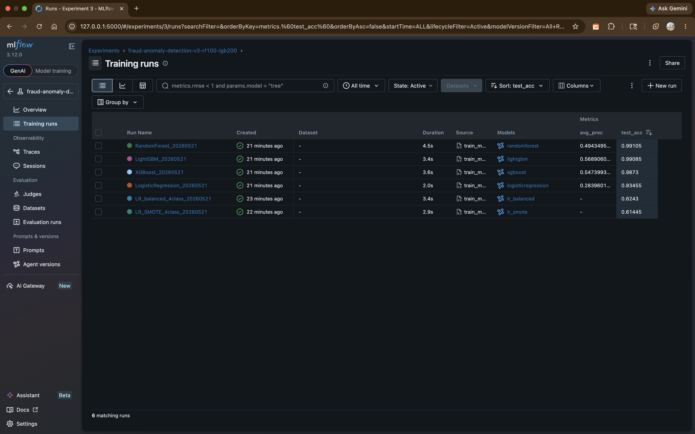

**Experiment 4 runs (rf300-lgb100):**
We flipped it  more RF trees (300) but fewer LGB rounds (100) to compare which setting works better.

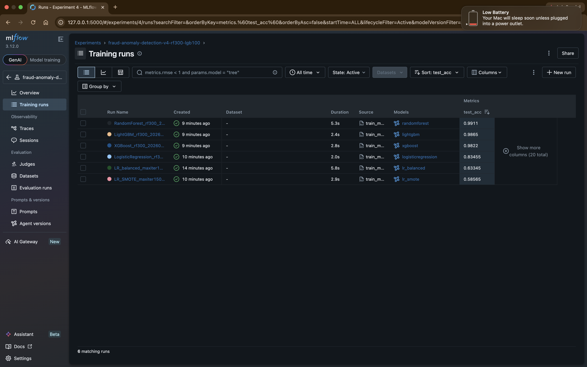

**Cross-experiment runs comparison (sorted by cv_mean_f1):**
We put all runs from both experiments side by side to see which model and config scored highest.

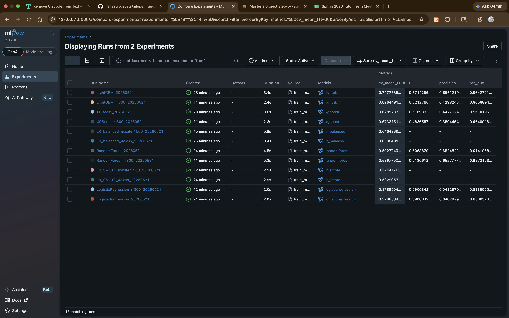

**LR_balanced comparison across experiments (parallel coordinates):**
This chart shows how the LR model performed with max_iter=500 vs max_iter=1500  higher iterations helped a little.

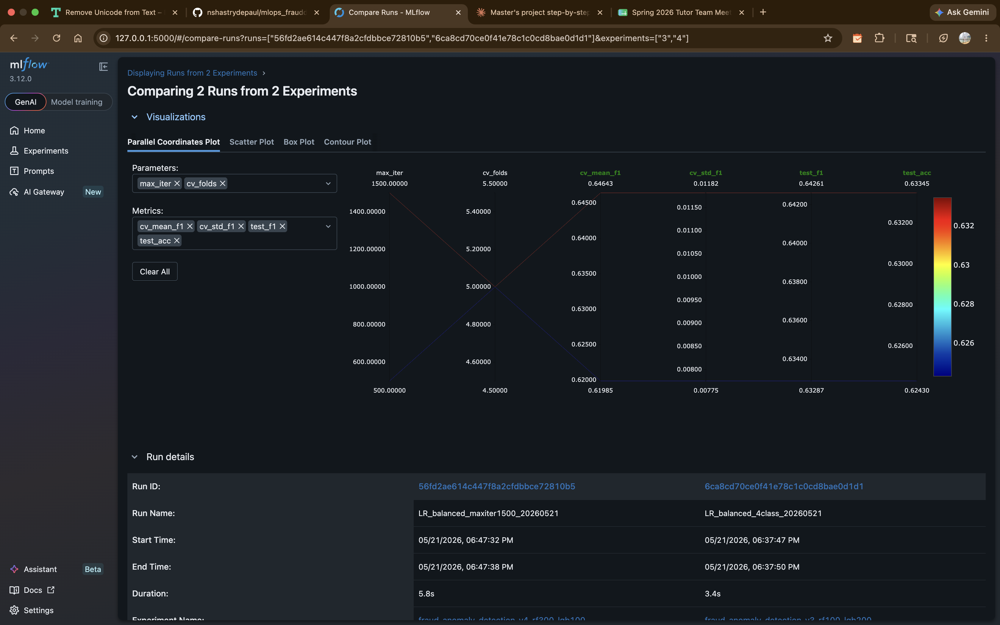

**LR_balanced metrics comparison:**
Side by side metrics show max_iter=1500 got cv_mean_f1 of 0.646 vs 0.620 with max_iter=500  more iterations = better.

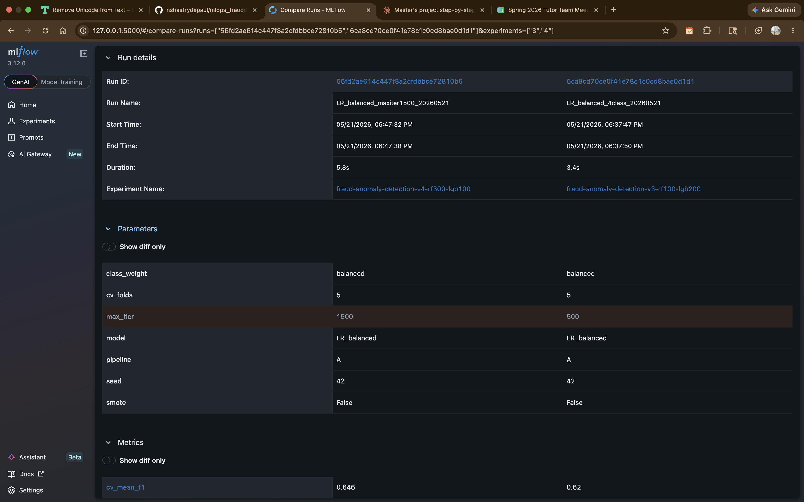

**LR_balanced parameters diff (max_iter: 1500 vs 500):**
MLflow highlights the only difference between the two runs  max_iter changed from 500 to 1500.

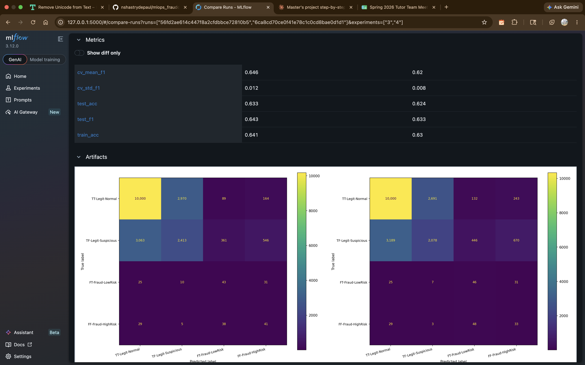

**LightGBM comparison across experiments:**
We compared LightGBM with 200 rounds vs 100 rounds  turns out 200 rounds gave better cv_mean_f1 (0.718 vs 0.696).

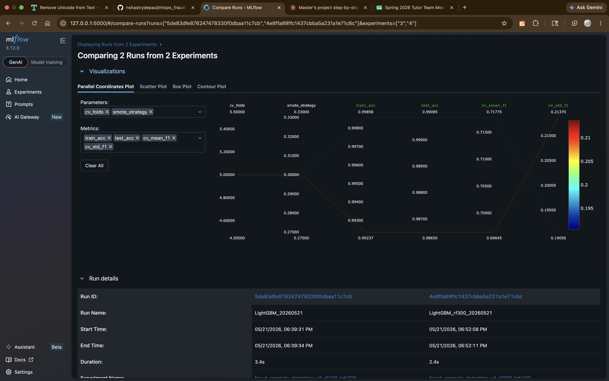

**LightGBM metrics + classification report artifacts:**
Both runs logged their classification reports as artifacts so we can see precision, recall and F1 per class.

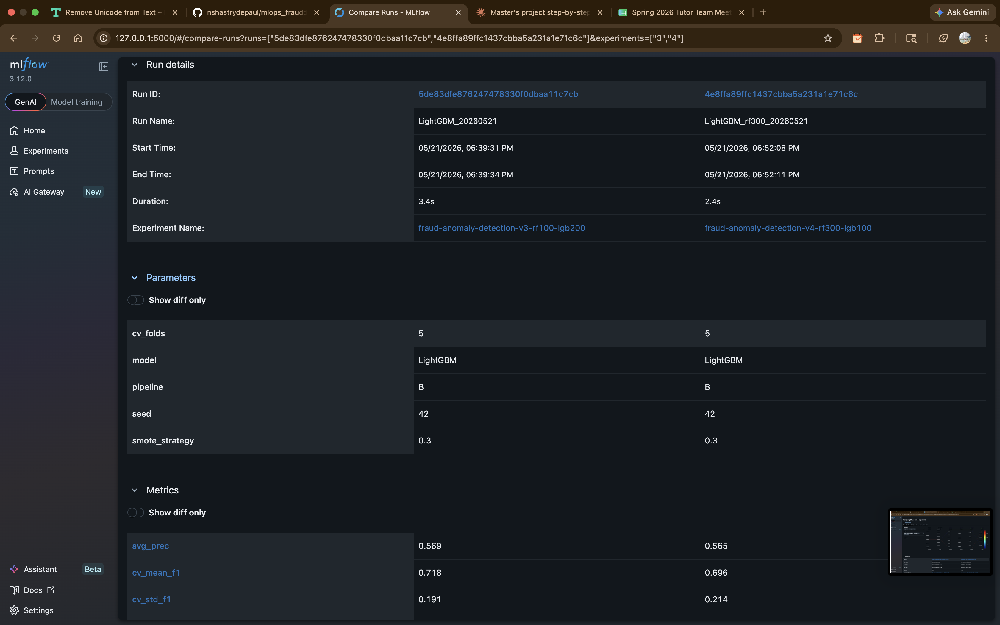

**LightGBM parameters diff:**
The only difference between the two LightGBM runs was the number of estimators  everything else stayed the same.

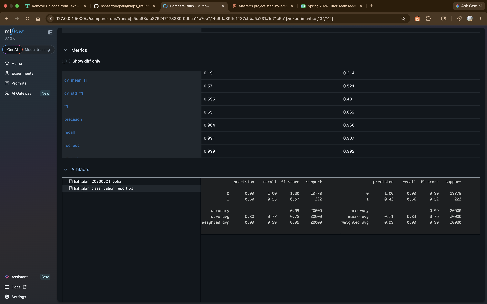

---

##  Experiment 1 vs Experiment 2

* Experiment 1 (deafult):
Our baseline run with default settings  max_iter=1000 for LR, 
RF=200 trees, LGB=500 rounds. This is what we compare everything else against.

* Experiment 2 (v2-max-iter500):
We ran just the LR model with fewer iterations (500 instead of 1000) 
to see if less training time affects accuracy.

**All runs from both experiments side by side:**
We put all LR runs from Experiment 1 (iter=1000) and Experiment 2 (iter=500) 
together to see which configuration performed better.

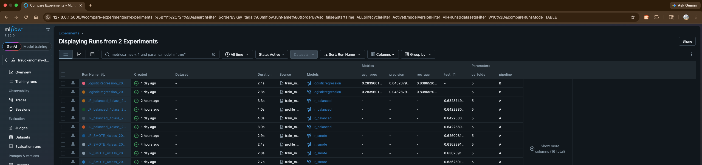

**LR_balanced parallel coordinates plot:**
This shows that LR_balanced with max_iter=1000 got cv_mean_f1 of 0.641 
compared to 0.620 with max_iter=500  more iterations clearly helped.

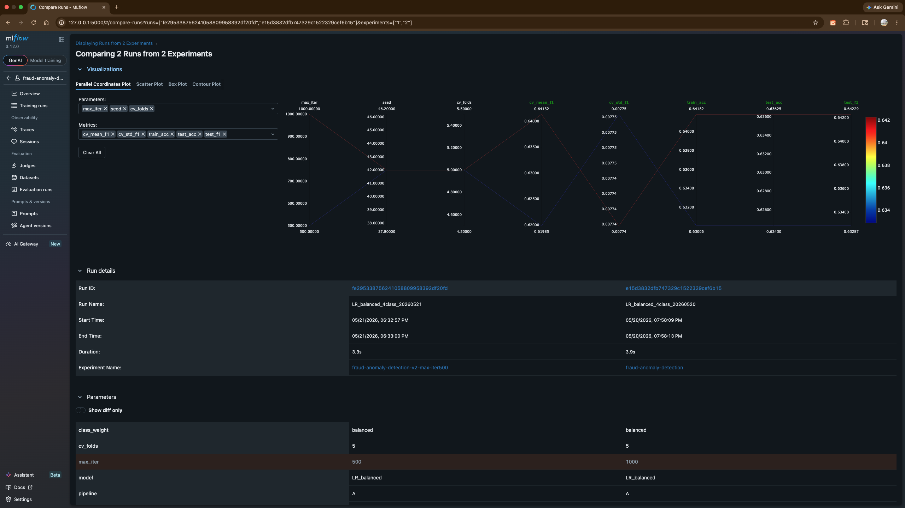

**LR_balanced metrics side by side:**
With max_iter=1000 we got test_f1=0.642 vs 0.633 with max_iter=500  
the model converged better with more iterations.

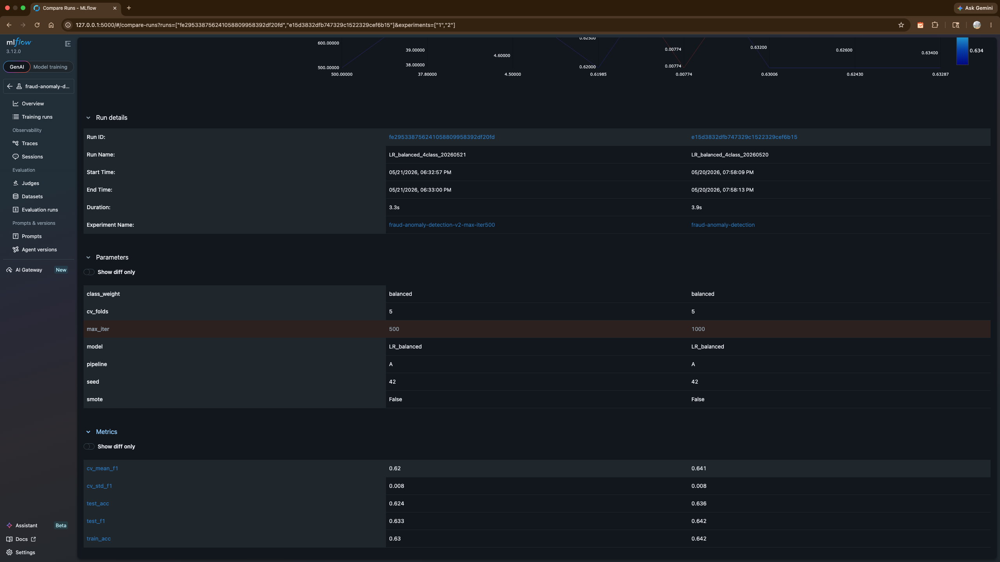

**LR_SMOTE parallel coordinates plot:**
Same pattern for SMOTE model  max_iter=1000 got cv_mean_f1 of 0.521 
vs 0.503 with max_iter=500  SMOTE also benefits from more iterations.

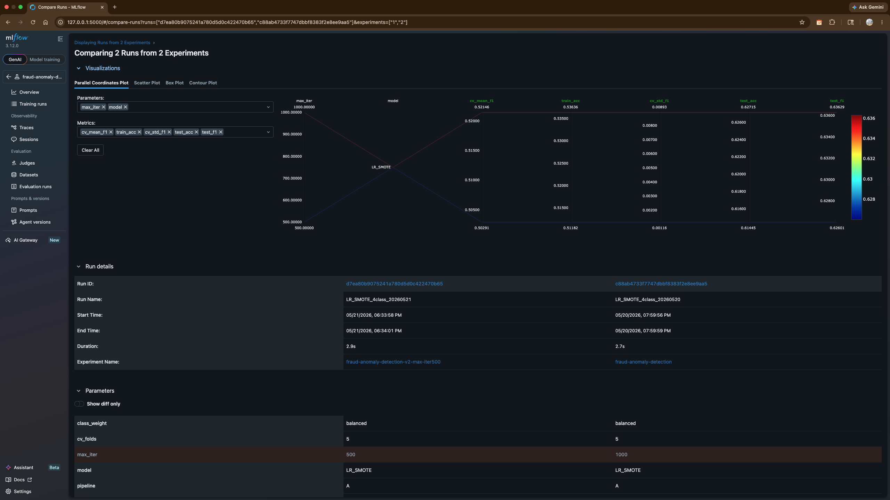

**LR_SMOTE metrics side by side:**
max_iter=1000 gives test_f1=0.636 vs 0.626 with max_iter=500  
the difference is small but consistent across both LR models.

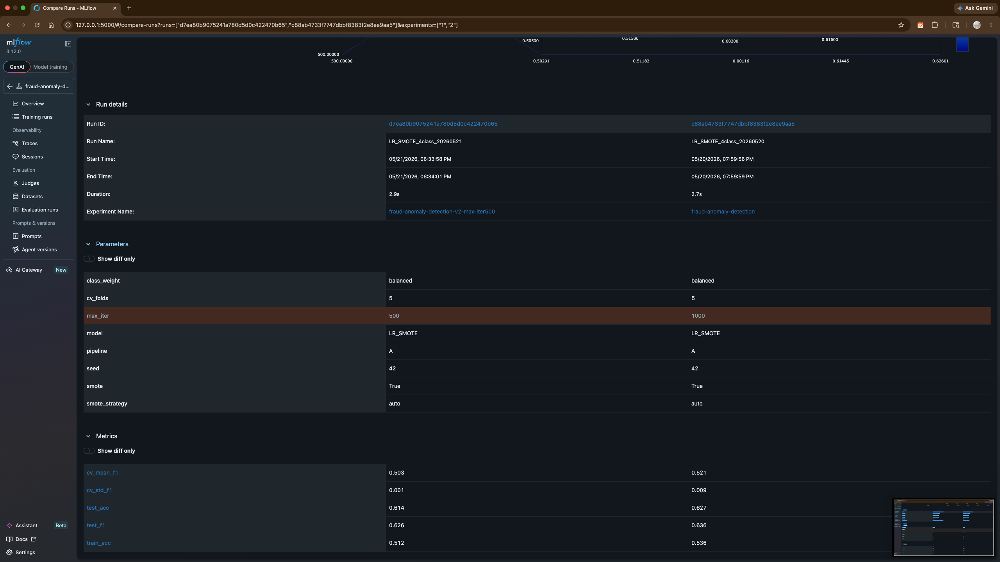

---
