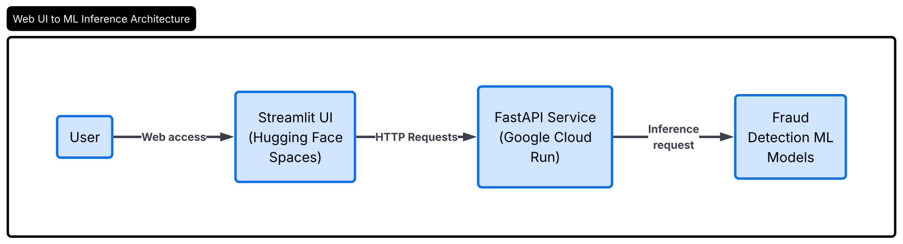
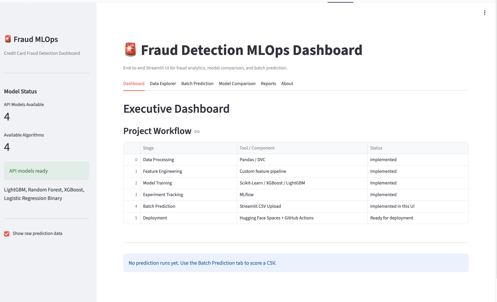
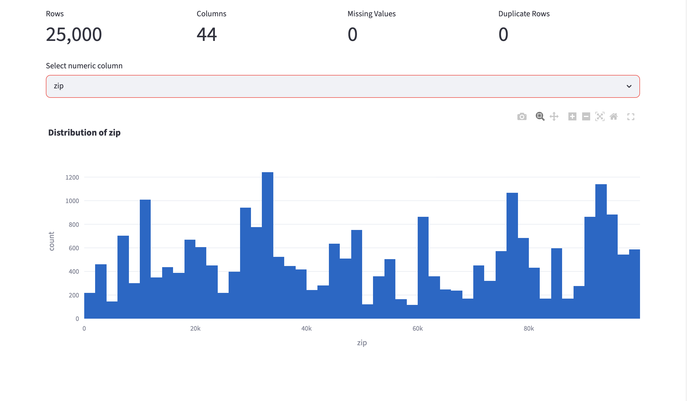
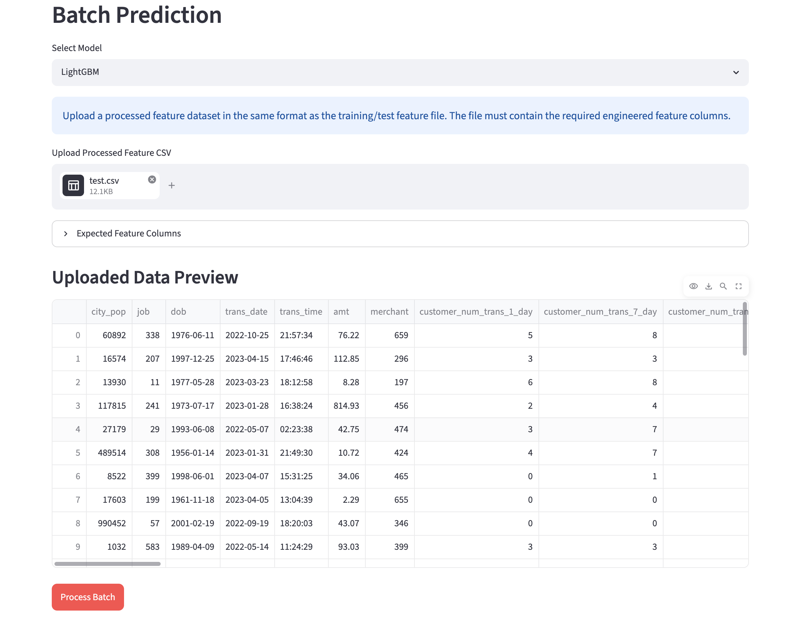
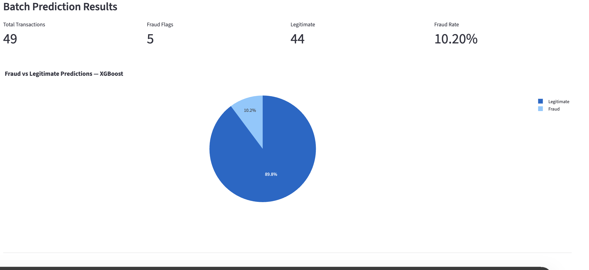
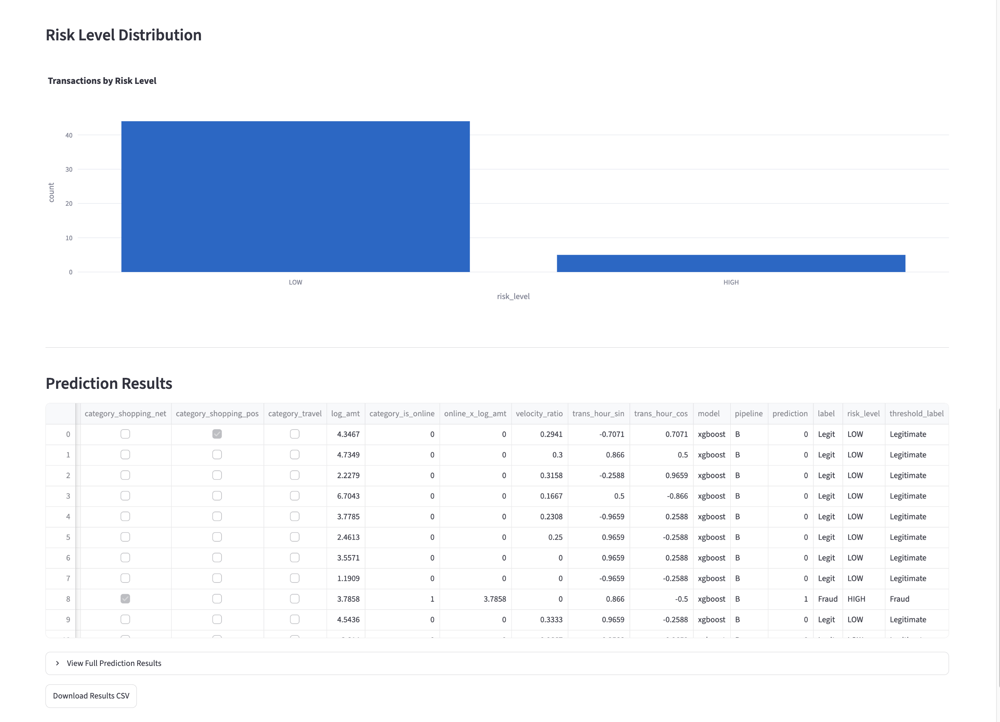
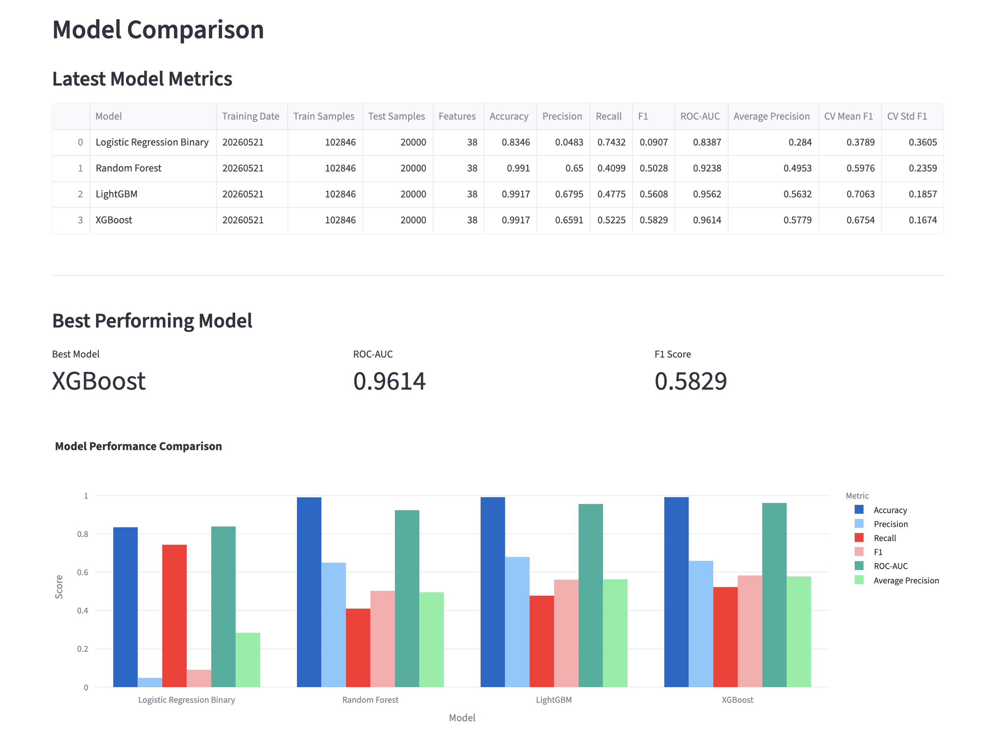
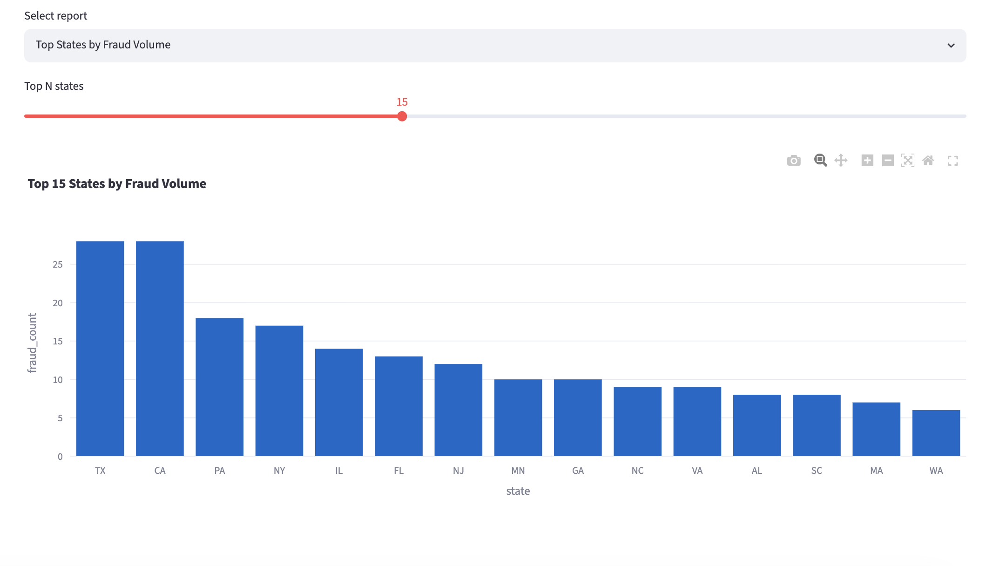
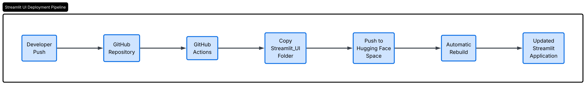

# Phase 3 – Deployment and User Interface Documentation
---

# Overview

This document presents the deployment and user interface components developed for the Fraud Detection MLOps project. The deployment phase focused on making the trained machine learning models accessible through a cloud-based prediction service and providing an intuitive web interface for end users.

A Streamlit application was developed and deployed on Hugging Face Spaces to enable users to explore data, upload transaction datasets, generate fraud predictions, compare model performance, and view analytical reports. The application communicates with a FastAPI backend deployed on Google Cloud Run, which serves the fraud detection models and processes prediction requests.

In addition, a GitHub Actions workflow was configured to automate deployment updates, ensuring that changes made to the application can be seamlessly deployed to the hosted environment. This document describes the deployment architecture, user interface features, backend integration, deployment workflow, and verification of the deployed system.

---

# Deployment Architecture

The final deployment architecture consists of a Streamlit frontend hosted on Hugging Face Spaces and a FastAPI prediction service hosted on Google Cloud Run.




# Streamlit User Interface

A Streamlit application was developed to provide an interactive interface for fraud detection.

## Features Implemented

### Dashboard

The Dashboard provides an overview of the project workflow and deployment architecture.



---

### Data Explorer

The Data Explorer allows users to inspect transaction data and explore fraud-related patterns through interactive visualizations.



The Data Explorer contains multiple interactive visualizations, including transaction distributions, fraud versus non-fraud comparisons, category-based analysis, customer activity insights, and summary statistics. A representative screenshot is shown.

---

### Batch Prediction

The Batch Prediction module enables users to upload transaction data and obtain fraud predictions.

Workflow:

1. Select prediction model
2. Upload CSV file
3. Submit prediction request
4. Receive fraud prediction results



---

### Prediction Results

The application displays:

* Fraud predictions
* Risk classifications
* Downloadable prediction results




---

### Model Comparison

Users can compare model performance across:

* Logistic Regression
* Random Forest
* LightGBM
* XGBoost




---

### Reports

The Reports section provides fraud analytics and summary visualizations.



The Reports section includes multiple analytical views and fraud-related visualizations. A representative report view is shown, while additional reports are available within the application.

---

# FastAPI Integration

The Streamlit application communicates with a FastAPI prediction service deployed on Google Cloud Run.

Prediction requests are sent using HTTP POST requests.

Example endpoint:

```http
POST /predict/pipeline-b/lightgbm
```

Health endpoint:

```http
GET /health
```

Example response:

```json
{
  "status": "healthy",
  "model_loaded": true
}
```

---

# Hugging Face Spaces Deployment

The Streamlit application was containerized using Docker and deployed to Hugging Face Spaces.

Deployment files included:

* app.py
* Dockerfile
* requirements.txt
* feature engineering modules
* supporting dataset files

The deployed application provides public access to the fraud detection dashboard.

---

# Automated Deployment Using GitHub Actions

To automate deployment, a GitHub Actions workflow was created.

Whenever changes are merged into the main branch, GitHub Actions automatically updates the Hugging Face Space.

## CI/CD Workflow



This workflow removes the need for manual deployment and keeps the deployed application synchronized with the repository.

---

# Conclusion

Phase 3 successfully delivered a deployed fraud detection platform consisting of:

* Streamlit frontend hosted on Hugging Face Spaces
* FastAPI prediction service hosted on Google Cloud Run
* Automated deployment using GitHub Actions
* End-to-end prediction workflow from CSV upload to fraud classification

The deployment demonstrates modern MLOps practices by integrating cloud-hosted model serving, automated deployment pipelines, and an interactive user interface for fraud detection.
