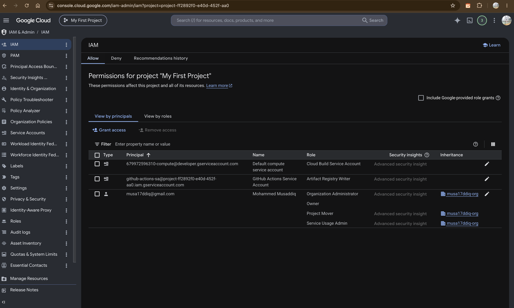
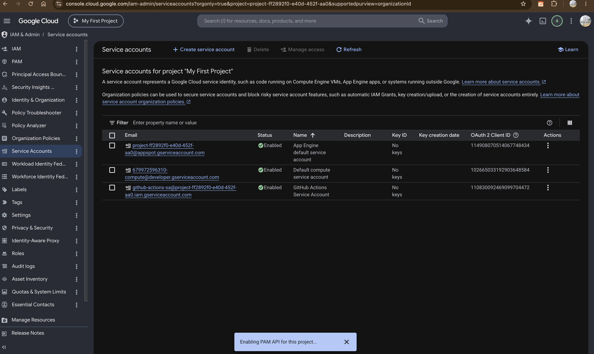
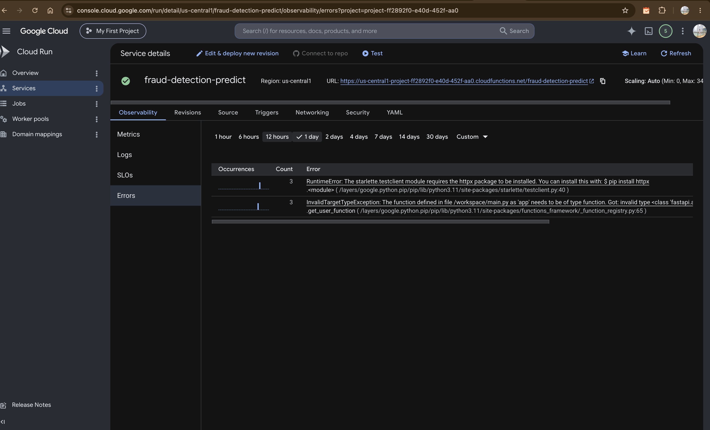
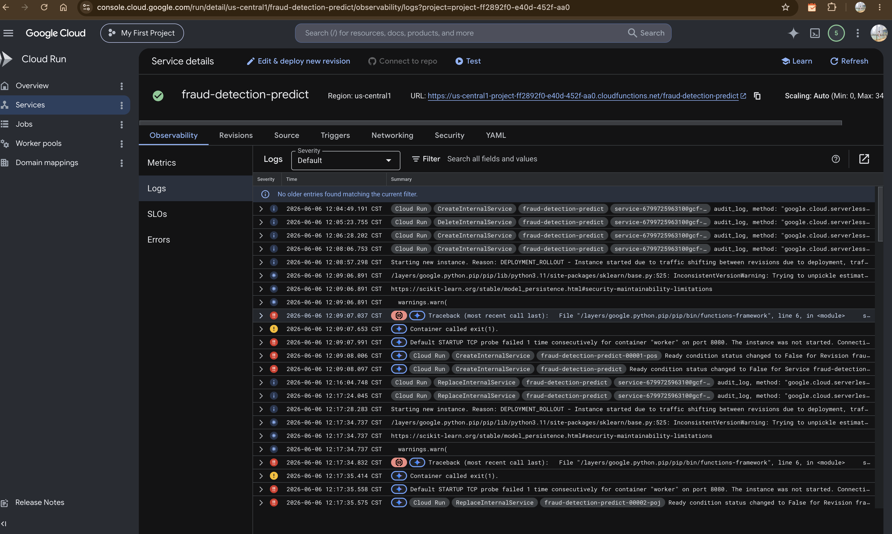
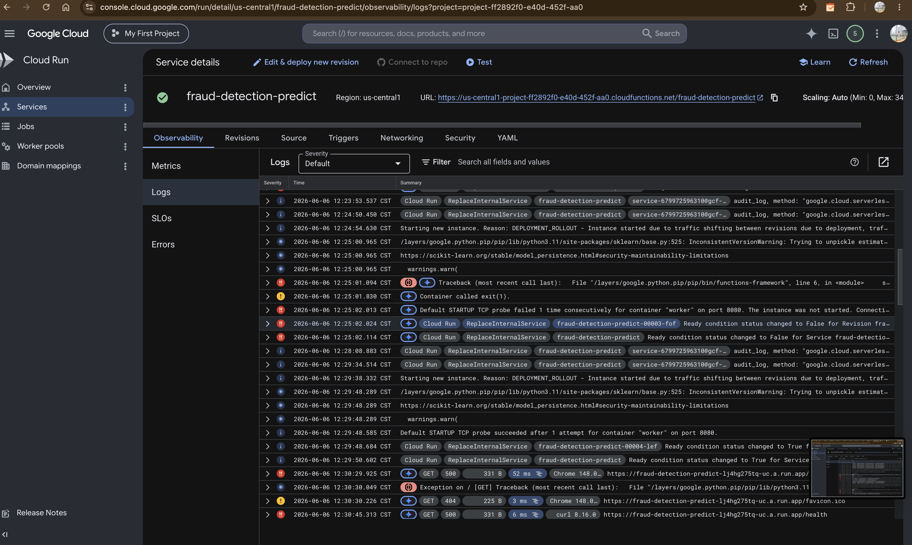
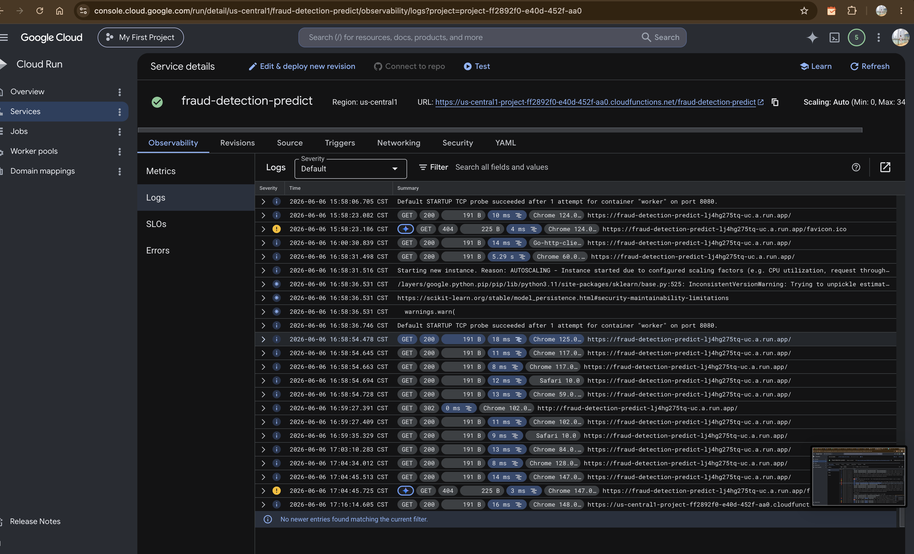
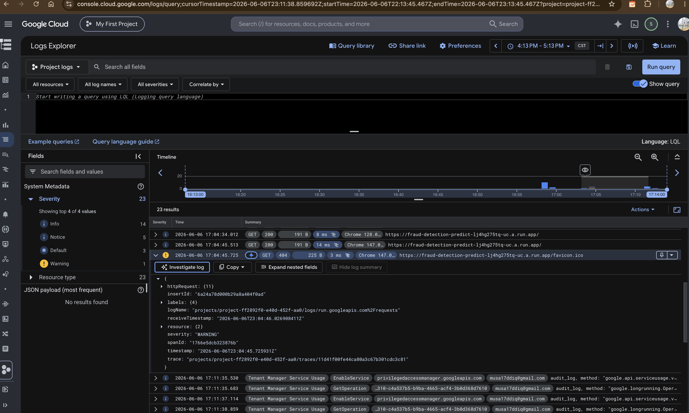
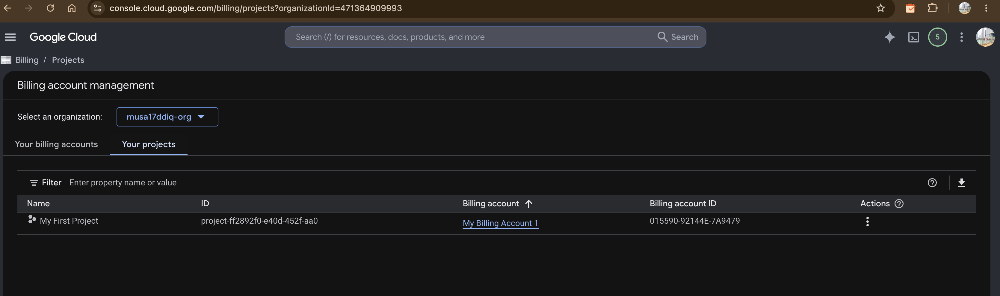
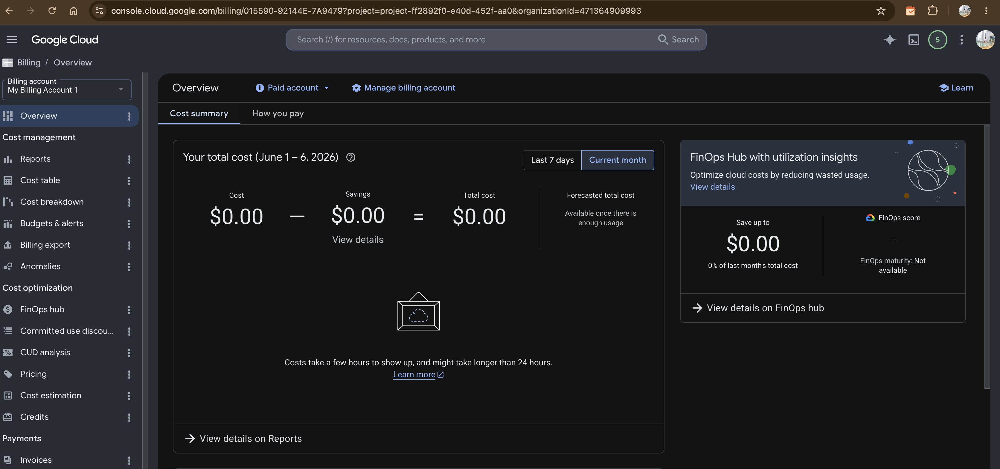

# Troubleshooting Guide  Phase 3 GCP Deployment

In this document, we will explain all the issues that occurred during the integration of the fraud detection API using GCP Cloud Functions. It could be considered as an "issue and fix" journal.

---

## 1. Authentication Issues

### Problem  Service Account Key Creation Blocked

We got blocked by the Google Cloud Platform when we tried creating a JSON key file for the service account of GitHub Actions:

```
ERROR: FAILED_PRECONDITION: Key creation is not allowed on this service account.
constraints/iam.disableServiceAccountKeyCreation
```

The reason for the block is the presence of a security policy called `iam.disableServiceAccountKeyCreation`.

### Solution
To overcome this issue, we made use of the Application Default Credentials by running the command `gcloud auth application-default login`. The credentials were saved using base64 encoding in a GitHub secret `GCP_CREDENTIALS`, thereby allowing GitHub Actions to authenticate to GCP.

### IAM Setup Evidence

The screenshot below shows the final IAM configuration  three principals with their roles:
- Default compute service account  Cloud Build Service Account
- `github-actions-sa`  Artifact Registry Writer (our service account)
- `musa17ddiq@gmail.com`  Owner (project creator)



The screenshot below shows all GCP service accounts automatically created when APIs were enabled:



---

## 2. Common Deployment Errors

### The Cloud Functions deployment failed 5 times before it worked

FastAPI's deployment in the Cloud Functions resulted in the following two errors, as seen on the Cloud Run Errors tab:



#### Error 1  `InvalidTargetTypeException`

```
The function defined in file /workspace/main.py as 'app' needs to be of type function.
Got: invalid type <class 'fastapi.applications.FastAPI'>
```

**Reason for the issue:** Cloud Functions is supposed to receive a Python function as the entry point, but instead we pass `--entry-point=app`, where `app` refers to the FastAPI application instance, not a function.

**Fix:** The FastAPI app is enclosed in an HTTP handler function using `functions_framework`:

```python
import functions_framework

@functions_framework.http
def fraud_predict(request):
    """GCP Cloud Functions entry point."""
    from starlette.testclient import TestClient
    client = TestClient(app)
    response = client.request(
        method=request.method,
        url=request.path,
        content=request.get_data(),
        headers=dict(request.headers),
    )
    return response.content, response.status_code, dict(response.headers)
```

Then changed `--entry-point=app` to `--entry-point=fraud_predict`.

#### Error 2  `RuntimeError: httpx package not installed`

```
RuntimeError: The starlette.testclient module requires the httpx package.
```

**Why it happened:** The `TestClient` inside our wrapper function requires `httpx` but it wasn't in `api/requirements.txt`.

**Fix:** Added `httpx>=0.24.0` to `api/requirements.txt` and redeployed.

---

### Cloud Run deployment logs showing live requests

Once the deployment succeeded, the Cloud Run logs started showing real HTTP requests coming in from our curl tests:





The logs show:
- `GET 200` requests to `/` and `/health`  API is live
- `GET 404` for `/favicon.ico`  expected, browser auto-requests this
- Response times of 814ms for cached model predictions

---

## 3. Training Job Errors

### Problem  Training job failed 4 times

The Vertex AI training job failed multiple times before succeeding. Each time it couldn't find the data files.

**Error 1:** `FileNotFoundError: data/processed/x_train.csv`
- Container started but data wasn't there
- Fix: Added GCS download code to `load_data()` in `train_model.py`

**Error 2:** `FileNotFoundError: 'gcloud' not found`
- Our fix used `subprocess.run(['gcloud', 'storage', 'cp', ...])` but `gcloud` isn't installed in the training container
- Fix: Replaced with `google-cloud-storage` Python library

**Error 3:** `data_path.exists()` returned True for empty directory
- The container had an empty `data/processed/` folder, so our `if not data_path.exists()` check skipped the download
- Fix: Changed condition from `if gcs_path and not data_path.exists()` to just `if gcs_path:`

**Error 4:** `_validate_config` failed before `load_data` even ran
- Hydra config validation checked if `data.processed_path` exists before our download code ran
- Fix: Added `if not os.environ.get("GCS_DATA_PATH")` to skip path check when GCS is configured

The training logs showed the job finally downloading data and running successfully:



---

## 4. Cost Monitoring

### How much did this cost?

The billing page shows the project is linked to a billing account. All services used stayed within GCP free tier limits:

- Cloud Functions: 2M requests/month free  we used ~50
- Cloud Run: 2M requests/month free  we used ~50
- GCS: 5GB free in us-central1  we used ~75MB
- Vertex AI: charged per minute  ~8 minutes at $0.19/hr = ~$0.03

**Total estimated cost:





---

## 5. Quick Reference  Common Errors and Fixes

| Error | Cause | Fix |
|---|---|---|
| `InvalidTargetTypeException: app needs to be type function` | Cloud Functions entry point must be a function, not FastAPI object | Wrap with `@functions_framework.http` decorator |
| `RuntimeError: httpx package not installed` | Missing dependency for TestClient | Add `httpx>=0.24.0` to `api/requirements.txt` |
| `Container Healthcheck failed` | App not listening on PORT env var | Add `port = int(os.environ.get("PORT", 8080))` to main |
| `FileNotFoundError: data/processed/x_train.csv` | Training container has no local data | Download from GCS using `google-cloud-storage` |
| `FileNotFoundError: 'gcloud' not found` | gcloud CLI not in training container | Use Python `google-cloud-storage` library instead |
| `No module named 'xgboost'` | Wrong Python environment running uvicorn | Use `python -m uvicorn` not just `uvicorn` |
| `Key creation is not allowed` | Org policy blocks SA key creation | Use Application Default Credentials instead |
| `Billing must be enabled` | Project not linked to billing account | Link project to billing account in GCP Console |